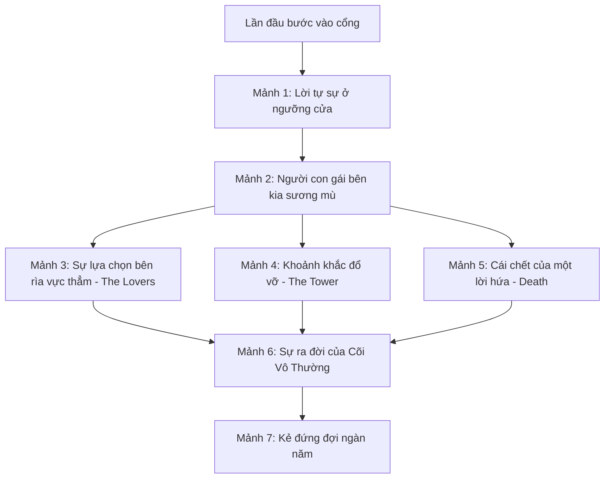
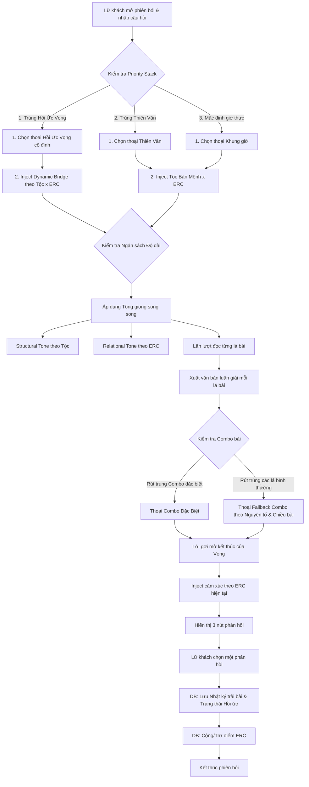
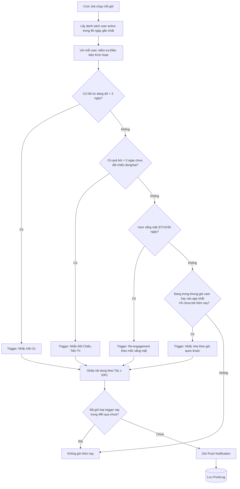
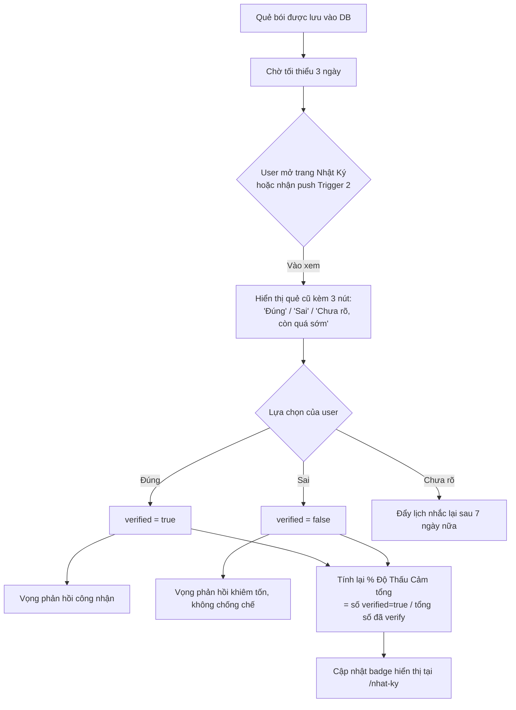

# CÕI VÔ THƯỜNG — THIẾT KẾ CỐT TRUYỆN CHUYÊN SÂU & HỆ THỐNG NARRATIVE

Tài liệu này là bản đặc tả chi tiết (Blueprint) về mặt cốt truyện và các cơ chế tương tác kể chuyện (Narrative Systems) cho ứng dụng Tarot **Cõi Vô Thường**. Bản đặc tả này đóng vai trò làm kim chỉ nam để lập trình logic hội thoại, cấu trúc cơ sở dữ liệu, và viết nội dung chi tiết cho 78 Sứ Giả.

---

## 1. BACKSTORY CHI TIẾT CỦA VỌNG (NGƯỜI GIỮ CỔNG)

Vọng không phải là một thực thể thần thánh vô tri. Vọng là một linh hồn bị mắc kẹt tại ngưỡng cửa Cõi Vô Thường bởi chính sự lựa chọn trong quá khứ của mình. Để lữ khách cảm thấy gắn kết và muốn quay lại app, backstory của Vọng sẽ được hé lộ dần qua **7 Mảnh Hồi Ức**.

### 1.1 Luật mở khoá Hồi Ức
- **Mảnh 1, 2**: Mở khoá tự động sau lượt bói thứ 3 và thứ 7.
- **Mảnh 3, 4, 5**: Mở khoá khi lữ khách rút được các lá bài mang tính bước ngoặt (The Lovers, The Tower, Death) ở vị trí bất kỳ trong trải bài.
- **Mảnh 6, 7**: Mở khoá sau khi lữ khách đã hoàn thành 15 lượt bói hoặc gặp đủ 4 Tộc Người trong cõi.

### 1.2 Nội dung 7 Mảnh Hồi Ức của Vọng



#### Mảnh 1: Ngưỡng cửa không tuổi (Mở sau 3 lượt bói)
> "Lữ khách... ngươi có bao giờ tự hỏi vì sao ta lại ở đây không? Giữa cõi sương mù không có ngày và đêm này. Đã có lúc ta cũng như ngươi, mang theo một trái tim đập rộn ràng và đầy rẫy những câu hỏi chưa có lời đáp. Ta từng tin rằng chỉ cần đi đủ xa, ta sẽ tìm thấy câu trả lời cho tất cả. Nhưng cuối cùng, ta lại chọn dừng chân ngay tại ngưỡng cửa này, để nhìn dòng người qua lại..."

#### Mảnh 2: Người đồng hành đầu tiên (Mở sau 7 lượt bói)
> "Thuở ấy, cõi này chưa được gọi là Cõi Vô Thường. Nó chỉ là một thung lũng sương mù vô danh. Ta không đi một mình. Bên cạnh ta từng có một người... một lữ khách dũng cảm hơn ta rất nhiều. Nàng không sợ vực sâu, cũng không sợ sương tối. Nàng nói: *'Nếu sương mù che lối, ta sẽ tự biến mình thành ánh sáng.'* Ta đã yêu sự liều lĩnh đó, nhưng cũng chính sự liều lĩnh đó đã rẽ lối hai chúng ta."

#### Mảnh 3: Sự lựa chọn bên rìa vực thẳm (Mở khi rút được lá **The Lovers**)
> "Nhìn Sứ Giả Song Sinh Trái Tim đứng đó, ta lại nhớ về ngày hai chúng ta đứng trước Ngã Rẽ Sương Mù. Một bên là lối đi bình yên trở về nhân thế, nơi chúng ta có thể già đi cùng nhau như những người bình thường. Một bên là con đường tiến sâu vào cõi vô định để tìm kiếm chân lý tối thượng. Ta đã do dự, còn nàng thì ánh mắt kiên định nhìn về phía bóng tối. Khoảnh khắc ta buông tay nàng để lùi lại một bước... đó là lựa chọn định hình cả kiếp này của ta."

#### Mảnh 4: Khoảnh khắc đổ vỡ (Mở khi rút được lá **The Tower**)
> "Sự sụp đổ không bao giờ báo trước một cách êm ái. Khi nàng bước sâu vào cõi, mặt đất rung chuyển, thung lũng sương mù sụp xuống như một toà tháp bằng cát gặp bão lớn. Ta đã cố chạy theo, cố níu lấy vạt áo của nàng, nhưng sương mù cuộn lên như những lưỡi kiếm cắt đứt mọi kết nối. Ta chỉ biết trơ mắt nhìn thế giới cũ của mình tan rã. Đôi khi, giữ lại một thứ đã vỡ chỉ làm tay ta thêm chảy máu, lữ khách ạ."

#### Mảnh 5: Cái chết của một lời hứa (Mở khi rút được lá **Death**)
> "Mọi người sợ Sứ Giả Cánh Cửa Khép Lại vì nghĩ đó là sự kết thúc. Nhưng ta biết, đó là sự giải thoát. Khi sương mù lắng xuống, nàng không còn ở đó nữa. Nàng đã tan vào cõi giới này, trở thành linh hồn của những lá bài, thành chính những Sứ Giả đang trò chuyện với ngươi hôm nay. Lời hứa cùng nhau trở về đã chết, nhưng một thế giới mới — Cõi Vô Thường này — đã được sinh ra từ tro tàn của lời hứa đó."

#### Mảnh 6: Sự ra đời của các Sứ Giả (Mở sau khi gặp đủ 4 Tộc Người)
> "Nàng đã hoá thân vào bốn tộc người trong cõi. Nhiệt huyết của nàng hoá thành Tộc Diễm Hoả. Tình yêu sâu nặng hoá thành Tộc Thuỷ Nguyệt. Những suy nghĩ trăn trở hoá thành Tộc Phong Kiếm. Và sự kiên cường, thực tế hoá thành Tộc Thổ Kim. Mỗi khi ngươi rút một lá bài, thực chất ngươi đang chạm vào một phần linh hồn phân rã của nàng. Ta canh giữ cổng này để mỗi ngày được nhìn thấy nàng hiện về qua những câu chuyện của các ngươi."

#### Mảnh 7: Kẻ đợi chờ ngàn năm (Mở sau 15 lượt bói)
> "Giờ thì ngươi đã biết câu chuyện của ta rồi, lữ khách. Ta là Vọng, kẻ trông ngóng một người đã hoá thân vào vạn vật. Ta không thể bước vào trong cõi để tìm nàng, cũng không thể trở lại nhân gian vì đã đánh mất trái tim trần thế. Ta đứng đây, giúp những lữ khách như ngươi tìm ra câu trả lời cho tình cảm của mình, với hy vọng một ngày nào đó, có một lữ khách sẽ mang theo thông điệp của nàng từ sâu trong cõi sương mù trở ra trao lại cho ta."

---

## 2. HỆ THỐNG COMBO NARRATIVE (LIÊN KẾT GIỮA CÁC SỨ GIẢ)

Khi lữ khách rút nhiều lá bài trong một trải bài (ví dụ trải bài 3 lá: Bản thân – Đối phương – Mối quan hệ), thay vì chỉ đọc độc lập từng lá, Vọng sẽ nhận diện các **Combo đặc biệt** và đưa ra lời bình luận chuyển tiếp (Transition dialogue) cực kỳ huyền bí và sâu sắc.

### 2.1 Cặp đôi Đối Nghịch (Tension Combo)

#### Combo: Sứ Giả Ngọn Lửa Sụp Đổ (The Tower) + Sứ Giả Ánh Sao Hy Vọng (The Star)
- **Bối cảnh:** Thường xuất hiện ở vị trí Quá khứ - Hiện tại hoặc Bản thân - Đối phương.
- **Lời dẫn của Vọng:**
  > "Lữ khách, hãy nhìn xem. Sứ Giả Ngọn Lửa Sụp Đổ vừa dọn đi đống đổ nát cũ, thì ngay lập tức Sứ Giả Ánh Sao Hy Vọng đã thắp đèn bước tới. Cõi sương mù này rất tàn nhẫn nhưng cũng rất bao dung. Đổ vỡ của ngươi không phải để huỷ diệt, mà là khoảng trống bắt buộc phải có để ánh sao này rọi vào. Ngươi đã sẵn sàng dập tắt tàn dư của ngọn lửa cũ để đón nhận nguồn nước chữa lành này chưa?"

#### Combo: Sứ Giả Dây Xích Tự Nguyện (The Devil) + Sứ Giả Cánh Cửa Khép Lại (Death)
- **Bối cảnh:** Nói về một mối quan hệ độc hại, phụ thuộc nhưng đang đi đến hồi kết.
- **Lời dẫn của Vọng:**
  > "Một bên là sợi xích vô hình giữ chân ngươi trong bóng tối (The Devil), một bên là lưỡi hái sẵn sàng cắt đứt tất cả (Death). Hai vị Sứ Giả này đang đứng cạnh nhau như muốn hỏi ngươi: Ngươi muốn tự mình tháo xích bước đi, hay đợi số phận dùng cách đau đớn nhất để cắt đứt nó? Cánh cửa đang khép lại rồi, đừng ngoảnh đầu nhìn sợi xích đó nữa."

### 2.2 Cặp đôi Đồng Điệu (Harmony Combo)

#### Combo: Sứ Giả Song Sinh Trái Tim (The Lovers) + Sứ Giả bậc 2, Tộc Thuỷ Nguyệt (Two of Cups)
- **Bối cảnh:** Tình yêu chớm nở hoặc sự kết nối tâm giao cực kỳ mạnh mẽ.
- **Lời dẫn của Vọng:**
  > "Ta nghe thấy tiếng nhạc vang lên từ phía sâu trong cõi. Khi Song Sinh Trái Tim tìm thấy nhau dưới vầng sáng lớn, và hai chiếc chén của Tộc Thuỷ Nguyệt được nâng lên đồng điệu. Đây không chỉ là sự thích thú thông thường, lữ khách ạ. Đây là khoảnh khắc hai linh hồn nhận ra nhau giữa vạn người. Đừng để nỗi sợ của lý trí dập tắt sự cộng hưởng hiếm hoi này."

#### Combo: Học Trò Tộc Diễm Hoả (Page of Wands) + Kỵ Sĩ Tộc Diễm Hoả (Knight of Wands)
- **Bối cảnh:** Năng lượng lửa quá mạnh, nồng nhiệt nhưng bốc đồng, thiếu kiểm soát.
- **Lời dẫn của Vọng:**
  > "Cẩn thận kẻo bỏng, lữ khách. Cả Học Trò lẫn Kỵ Sĩ của Tộc Diễm Hoả đều đang phi ngựa tới. Họ mang theo ngọn lửa của sự khởi đầu đầy phấn khích và tốc độ lao đi không phanh. Tình cảm này đang nóng lên rất nhanh, nhưng lửa cháy to thì nhanh lụi. Ngươi có đủ nước để giữ ngọn lửa này cháy bền bỉ, hay cũng đang muốn lao vào thiêu rụi một lần rồi thôi?"

### 2.3 Bảng quy hoạch các Combo cốt lõi cần lập trình logic

| Tên Combo | Các lá cấu thành | Chủ đề truyền tải | Trạng thái cảm xúc |
|---|---|---|---|
| **Tro Tàn Chữa Lành** | The Tower + The Star | Sự tái sinh sau biến cố | Hy vọng, nhẹ lòng |
| **Sợi Dây Giải Thoát** | The Devil + Death | Chấm dứt sự phụ thuộc, độc hại | Quyết liệt, đau đớn |
| **Tiếng Gọi Linh Hồn** | The Lovers + 2 of Cups | Tình yêu định mệnh, kết nối sâu | Hạnh phúc, thăng hoa |
| **Cơn Bão Lửa** | Page/Knight of Wands + Knight of Wands | Sự vội vã, nồng nhiệt thiếu kiên nhẫn | Phấn khích, lo âu |
| **Bức Tường Lý Trí** | Queen/King of Swords + 9 of Swords | Sự tự cô lập, suy nghĩ quá nhiều gây mất ngủ | Mệt mỏi, bế tắc |
| **Vườn Xuân Đơm Hoa** | The Empress + 10 of Pentacles | Tình cảm đi đến cam kết gia đình vững chắc | Bình yên, đủ đầy |

### 2.4 [MỚI] Hệ thống Combo mặc định (Fallback Logic)
Để đảm bảo bất kỳ lượt trải bài nào (dù không thuộc 6 combo đặc biệt ở trên) vẫn có lời bình luận liên kết mượt mà từ Vọng, hệ thống sử dụng thuật toán Fallback Combo dựa trên việc phân tích **Mối quan hệ Nguyên tố** và **Chiều hướng năng lượng**.

```
[2 Lá Bài Bất Kỳ] 
   │
   ├──> 1. Kiểm tra Mối quan hệ Nguyên tố (Tương sinh / Tương khắc / Trung tính)
   ├──> 2. Kiểm tra Chiều hướng năng lượng (Xuôi-Xuôi / Xuôi-Ngược / Ngược-Ngược)
   └──> 3. Kiểm tra Nhóm năng lượng (Major-Major / Major-Minor / Minor-Minor)
```

#### Bước 1: Phân tích Nguyên tố
Hệ thống xác định tộc của 2 lá bài được so sánh để lấy mối quan hệ nguyên tố:
* **Tương Sinh (Đồng điệu cát lành):** Thuỷ Nguyệt + Thuỷ Nguyệt, Thổ Kim + Thổ Kim, Thuỷ Nguyệt + Thổ Kim (Nước nuôi dưỡng Đất), Diễm Hoả + Phong Kiếm (Gió thổi bùng Lửa), Diễm Hoả + Diễm Hoả, Phong Kiếm + Phong Kiếm.
* **Tương Khắc (Mâu thuẫn, giằng xé):** Thuỷ Nguyệt + Diễm Hoả (Nước dập Lửa), Phong Kiếm + Thổ Kim (Gió bào mòn Đất), Thuỷ Nguyệt + Phong Kiếm (Nước gặp Gió bão), Diễm Hoả + Thổ Kim (Lửa thiêu Đất cằn).

#### Bước 2: Phân tích Chiều hướng bài (Orientations)
* **Thuận - Thuận (Xuôi - Xuôi):** Năng lượng thông suốt, hướng ngoại, chủ động phát triển.
* **Hỗn Hợp (Xuôi - Ngược):** Có sự mâu thuẫn giữa vẻ ngoài và nội tâm, hoặc một bên tiến một bên lùi.
* **Nghịch - Nghịch (Ngược - Ngược):** Tắc nghẽn sâu sắc, tổn thương tiềm ẩn cần tạm dừng.

#### Bước 3: Lời thoại Fallback mẫu được sinh ra
Hệ thống sẽ ghép các đoạn tương ứng để Vọng tự động phát ngôn theo cấu trúc:
`[Lời dẫn Nguyên tố] + [Lời bình Chiều hướng] + [Câu gợi mở cho lữ khách]`

##### Mẫu 1: Tương Sinh + Thuận - Thuận (Ví dụ: 3 of Cups xuôi + 9 of Pentacles xuôi)
> "Ta nhìn thấy dòng chảy của hai Sứ Giả này đang hòa vào nhau rất êm đềm — như nước mát tưới tắm cho mảnh đất lành dưới chân ngươi. Mọi sự đang tiến triển tự nhiên và nhận được sự đồng thuận từ cõi lòng đến thực tế. Lữ khách, ngươi có đang cảm thấy mọi sự dần trở nên rõ ràng và vững chãi hơn không?"

##### Mẫu 2: Tương Khắc + Thuận - Thuận (Ví dụ: Knight of Wands xuôi + Page of Cups xuôi)
> "Một bên là ngọn lửa Diễm Hoả hăm hở lao đi, một bên là làn nước Thuỷ Nguyệt sâu lắng đầy cảm xúc. Hai năng lượng này tuy đều đẹp nhưng lại đang khắc chế nhau, khiến lòng ngươi như vừa muốn bùng cháy vừa muốn dịu lại. Có phải ngươi đang cố ép mình phải đưa ra hành động mạnh mẽ trong khi tim ngươi chỉ muốn lặng im cảm nhận?"

##### Mẫu 3: Tương Khắc + Hỗn Hợp (Ví dụ: The Tower xuôi + 2 of Pentacles ngược)
> "Sự sụp đổ lớn của số mệnh đang va đập vào sự chao đảo trong đời sống thực tế của ngươi. Một bên ngoài mặt đã đổ vỡ, nhưng bên trong ngươi vẫn cố gắng xoay xở giữ thăng bằng một cách kiệt quệ. Đừng cố gồng gánh những mảnh vỡ nữa, lữ khách. Hãy buông tay để đất đá rơi xuống, ngươi mới có chỗ để đứng vững."

##### Mẫu 4: Tương Sinh + Nghịch - Nghịch (Ví dụ: 5 of Cups ngược + 8 of Cups ngược)
> "Cả hai chiếc chén đều đang úp ngược, sương mù bao phủ lấy những nỗi đau chưa thể gọi tên. Ngươi đang chìm trong dòng nước tù đọng của quá khứ, vừa muốn bỏ đi lại vừa không đành lòng cất bước. Khi cõi lòng đã kiệt quệ như vậy, trì hoãn không giúp ngươi bớt đau, nó chỉ làm sương đêm thấm lạnh thêm vào da thịt. Ngươi có muốn cho bản thân một cơ hội để thực sự khóc một lần rồi buông không?"

---

## 3. TỘC BẢN MỆNH CỦA LỮ KHÁCH (ARCHETYPE SYSTEM)

Để cá nhân hoá trải nghiệm, ứng dụng sẽ theo dõi hành vi rút bài và các câu hỏi của lữ khách. Sau **3 lượt bói đầu tiên**, Vọng sẽ làm một "lễ nhận diện" để gọi tên **Tộc Bản Mệnh** của lữ khách.

```
[Lịch sử bói bài] ──(Phân tích nguyên tố nổi trội)──> [Xác định Tộc Bản Mệnh] ──> [Thay đổi giọng điệu của Vọng]
```

### 3.1 Quy tắc xác định Tộc Bản Mệnh
Hệ thống tính điểm dựa trên 3 lượt bói gần nhất (mỗi lượt trải 3 lá, tổng cộng 9 lá bài):
- Rút trúng >= 4 lá chất **Wands** (Diễm Hoả) → **Tộc Diễm Hoả**
- Rút trúng >= 4 lá chất **Cups** (Thuỷ Nguyệt) → **Tộc Thuỷ Nguyệt**
- Rút trúng >= 4 lá chất **Swords** (Phong Kiếm) → **Tộc Phong Kiếm**
- Rút trúng >= 4 lá chất **Pentacles** (Thổ Kim) → **Tộc Thổ Kim**
- Nếu phân bố đều (không chất nào trội hẳn) → **Tộc Vô Thường** (Đặc biệt - người giữ sự cân bằng).

### 3.2 [SỬA] Giọng điệu của Vọng theo Tộc Bản Mệnh & Ngân hàng lời chào nhận diện
Mỗi tộc sẽ có 4 biến thể thoại khi Vọng lần đầu nhận diện hoặc gọi tên tộc của lữ khách ở các phiên bói sau, tránh lặp lại cụm từ cố định.

#### 1. Lữ khách thuộc Tộc Diễm Hoả (Hành giả Lửa)
* **Biến thể 1:** "Ta thấy ngọn lửa trong mắt ngươi, lữ khách Tộc Diễm Hoả. Ngươi luôn muốn lao về phía trước, muốn câu trả lời ngay lập tức. Nhưng sương mù của cõi này không tan bằng sức nóng, nó chỉ tan khi ngươi học được cách đứng yên gác kiếm."
* **Biến thể 2:** "Một đốm lửa nhỏ đang nhen nhóm quanh tà áo ngươi. Lữ khách Tộc Diễm Hoả, đam mê của ngươi rất mãnh liệt, nhưng hãy cẩn thận kẻo thiêu rụi chính những gì ngươi đang cố vun đắp. Đêm nay, ta khuyên ngươi nên phi ngựa chậm lại một nhịp."
* **Biến thể 3:** "Nhiệt huyết từ Tộc Diễm Hoả trong ngươi đang sưởi ấm cổng sương mù vốn lạnh lẽo này. Ngươi đến đây để tìm kiếm sự khẳng định đúng không? Nhưng đôi khi, câu trả lời tốt nhất lại là sự chấp nhận dừng bước."
* **Biến thể 4:** "Ta ngửi thấy mùi tàn tro và lửa ấm từ bước chân ngươi. Lữ khách Tộc Diễm Hoả, ngươi đã chiến đấu mệt mỏi rồi. Hãy tạm gác thanh đuốc xuống, cõi vô thường này sẽ che chở cho sự mệt mỏi của ngươi."

#### 2. Lữ khách thuộc Tộc Thuỷ Nguyệt (Hành giả Nước)
* **Biến thể 1:** "Ngươi lại mang một trái tim trĩu nước đến đây, lữ khách Tộc Thuỷ Nguyệt. Ngươi cảm nhận được nỗi đau của người khác trước cả nỗi đau của chính mình. Để ta giúp ngươi lọc bớt những sương mù đang làm mờ trực giác của ngươi."
* **Biến thể 2:** "Sương đêm nay ẩm ướt... hay chính cõi lòng ngươi đang rưng rưng lệ, lữ khách Tộc Thuỷ Nguyệt? Ngươi sống bằng con tim nhiều quá, đến mức sương mù cũng muốn hóa thành dòng nước bao bọc lấy ngươi."
* **Biến thể 3:** "Tiếng sóng lòng của người con Tộc Thuỷ Nguyệt luôn vang vọng đến cổng này trước khi ngươi đặt chân tới. Trực giác của ngươi rất mạnh, nhưng lòng ngươi cũng dễ bị tổn thương bởi những gợn sóng nhỏ nhất của đối phương. Ngươi có muốn ngồi xuống đây để mặt hồ tĩnh lại?"
* **Biến thể 4:** "Nước chảy qua đá mòn, nhưng nước cũng là thứ dịu dàng nhất. Lữ khách Tộc Thuỷ Nguyệt, tình cảm của ngươi sâu sắc như đại dương, nhưng đại dương ấy có đang làm chính ngươi ngột ngạt không?"

#### 3. Lữ khách thuộc Tộc Phong Kiếm (Hành giả Khí)
* **Biến thể 1:** "Lữ khách Tộc Phong Kiếm, ngươi định dùng lưỡi kiếm lý trí để mổ xẻ một tình cảm sao? Có những điều trong Cõi Vô Thường này chỉ hiện rõ khi ngươi chịu nhắm mắt lại và ngừng phân tích đúng sai."
* **Biến thể 2:** "Tiếng gió lạnh rít qua cổng... đó là suy nghĩ của ngươi đang bay nhảy không ngừng đấy, hành giả Tộc Phong Kiếm. Ngươi tự vẽ ra trăm ngàn kịch bản tổn thương để tự bảo vệ mình, nhưng thực chất ngươi đang tự giam mình trong bức tường lý trí."
* **Biến thể 3:** "Ta nghe thấy tiếng kiếm chạm nhau sắc lạnh từ tâm tư ngươi. Người của Tộc Phong Kiếm luôn tìm kiếm sự thật trần trụi nhất, nhưng liệu trái tim ngươi đã thực sự sẵn sàng để đối mặt với sự thật đó chưa?"
* **Biến thể 4:** "Một cơn gió buốt vừa lướt qua vai ta. Ngươi giấu cảm xúc sau lớp mặt nạ lạnh lùng của lý trí, đúng không lữ khách Phong Kiếm? Nhưng ở cõi này, sương mù rọi thấu tâm can, ngươi không cần phải tỏ ra mạnh mẽ với ta."

#### 4. Lữ khách thuộc Tộc Thổ Kim (Hành giả Đất)
* **Biến thể 1:** "Ngươi cần một nền đất vững để đứng, đúng không lữ khách Tộc Thổ Kim? Ngươi không tin vào những lời hứa bay bổng trong sương mờ. Sứ Giả hôm nay sẽ cho ngươi thấy đâu là nền móng thật sự mà ngươi có thể tự tay xây dựng."
* **Biến thể 2:** "Bàn chân ngươi bám đất rất chắc, lữ khách Tộc Thổ Kim. Ngươi luôn muốn mọi thứ phải rõ ràng, phải cam kết bằng hành động thực tế. Nhưng tình yêu đôi khi lại là một cái cây cần thời gian bén rễ trong im lặng, đừng nóng lòng đào đất lên xem."
* **Biến thể 3:** "Sự trầm tĩnh của Tộc Thổ Kim trong ngươi khiến ta thấy an lòng. Ngươi không tìm kiếm những ảo ảnh tình cảm nhất thời, ngươi tìm kiếm một khu vườn xanh tươi bền bỉ. Hãy xem hôm nay Sứ Giả nào sẽ đến để giúp ngươi vun trồng nó."
* **Biến thể 4:** "Đất đá có thể im lìm, nhưng đất đá chứa đựng những gì sâu nặng nhất. Lữ khách Tộc Thổ Kim, ngươi chịu đựng và hy sinh nhiều quá mà chẳng mấy khi mở lời than vãn. Hãy để ta lắng nghe gánh nặng ấy thay ngươi."

#### 5. Lữ khách thuộc Tộc Vô Thường (Hành giả Cân Bằng)
* **Biến thể 1:** "Ngươi mang sự cân bằng của cả bốn tộc người và một niềm tin trọn vẹn vào số mệnh khi gõ cổng đêm nay, lữ khách Tộc Vô Thường. Sương mù không che lối ngươi, nó đang đón chào một linh hồn biết trôi theo định mệnh."
* **Biến thể 2:** "Ta cảm nhận được sự tĩnh lặng lạ thường từ bước chân ngươi, lữ khách Tộc Vô Thường. Ngươi đứng giữa ngã rẽ của cõi mộng và thực mà lòng không chút xao động. Hãy để vòng xoay số phận hé lộ những điều dành riêng cho ngươi hôm nay."
* **Biến thể 3:** "Sương mù xung quanh như đang reo vui khi gặp lại người con của Tộc Vô Thường. Ngươi không bám chấp vào lửa ấm, nước sâu, gió lạnh hay đất dày, ngươi là chính sự chuyển dời vô định của cõi này. Nói ta nghe, vòng xoay nào đang gọi tên ngươi?"
* **Biến thể 4:** "Chào lữ khách của Tộc Vô Thường. Cõi sương này chính là nhà của ngươi, và ta chỉ là người tạm giữ cổng. Ngươi đến đây hôm nay để tìm kiếm sự chuyển dịch mới cho câu chuyện tình cảm của mình đúng không? Hãy lật bài đi."

---

## 4. NHỊP ĐIỆU CÕI VÔ THƯỜNG THEO THỜI GIAN THỰC (ATMOSPHERIC CHANGES)

Để thế giới trong app mang lại cảm giác "sống", bối cảnh sương mù của Cõi Vô Thường và lời chào của Vọng sẽ thay đổi dựa trên thời gian thực tế trên điện thoại của lữ khách.

### 4.1 [SỬA] Ngân hàng biến thể lời chào theo giờ (Variation Bank)

#### Khung giờ Sáng Sớm (05:00 – 08:00) — *Sương Sớm Lặng Lẽ*
* **Biến thể 1:** "Ngươi đến sớm thế, lữ khách? Sương mù ngoài cổng vẫn còn đọng nước, lạnh buốt. Những Sứ Giả ban ngày đang chầm chậm thức giấc. Câu hỏi của ngươi vào lúc sớm mai này... liệu có phải là điều đầu tiên ngươi nghĩ đến ngay khi vừa mở mắt?"
* **Biến thể 2:** "Chào buổi sớm mai, lữ khách. Bình minh của cõi này chỉ là một vệt hồng nhạt lẫn trong sương mỏng. Khi nhân gian chưa kịp thức giấc, lòng ngươi đã tìm đến đây. Có phải đêm qua ngươi đã mất ngủ vì một hình bóng?"
* **Biến thể 3:** "Ta nghe tiếng chân ngươi giẫm lên những giọt sương sớm chưa tan. Cổng cõi giới vừa mở. Hãy để làn gió ban mai thanh lọc những muộn phiền của ngày hôm qua trước khi ngươi rút bài."
* **Biến thể 4:** "Bình minh lên mang theo những hy vọng mới, nhưng sương mù của ta vẫn chưa tan hết. Ngươi đến gõ cửa giờ này, hẳn là đang mang một quyết tâm lớn cho ngày hôm nay?"

#### Khung giờ Ban Ngày (08:00 – 17:00) — *Sương Tỏ Đường Đi*
* **Biến thể 1:** "Cổng Cõi Vô Thường vẫn luôn mở giữa những bận rộn của nhân thế. Nói ta nghe, điều gì giữa ban ngày huyên náo lại khiến lòng ngươi chợt lặng đi và tìm đến đây?"
* **Biến thể 2:** "Ánh mặt trời ngoài kia có chiếu sáng được những góc tối trong lòng ngươi không, lữ khách? Ta đứng đây đợi ngươi, tách biệt khỏi thế giới xô bồ ngoài kia. Hãy trút bỏ gánh nặng bên ngoài cổng trước khi bước vào."
* **Biến thể 3:** "Giữa dòng đời hối hả, ngươi lại chọn rẽ lối vào cõi sương mù này. Điều gì đang xảy ra ngoài kia khiến ngươi cần một điểm tựa tĩnh lặng đến thế?"
* **Biến thể 4:** "Sương mù ban ngày mỏng nhất, để lộ ra những lối đi rõ ràng. Nếu lòng ngươi đang phân vân giữa những lựa chọn của công việc hay tình cảm, hãy cứ hỏi, các Sứ Giả ban ngày luôn rất thực tế."

#### Khung giờ Hoàng Hôn (17:00 – 20:00) — *Sương Tím Chạng Vạng*
* **Biến thể 1:** "Ngày đang tàn dần bên cõi của ngươi rồi phải không? Hoàng hôn là lúc ranh giới giữa thực và mộng mỏng nhất. Hãy ngồi xuống đây, uống một chén trà sương, rồi kể ta nghe điều gì đang làm lòng ngươi phân vân."
* **Biến thể 2:** "Mặt trời lặn, để lại một khoảng trời màu tím đỏ pha lẫn sương mù. Thời khắc chạng vạng luôn làm lòng người yếu mềm đi một chút. Ngươi đến đây vào lúc này, có phải vì cảm giác cô đơn đang dâng lên?"
* **Biến thể 3:** "Sương chạng vạng đang buông xuống vai ngươi rồi kìa, lữ khách. Khi một ngày kết thúc, những câu hỏi chưa có lời đáp lại càng trở nên rõ ràng hơn. Hãy để ta xem Sứ Giả nào đang đợi ngươi lúc hoàng hôn."
* **Biến thể 4:** "Ranh giới của ngày và đêm đang mờ đi. Đây là lúc trực giác của ngươi nhạy bén nhất. Hãy nhắm mắt lại một chút, hít thở sâu, rồi mở mắt ra nhìn những Sứ Giả đang hiện hình."

#### Khung giờ Đêm Muộn (20:00 – 03:00) — *Đêm Sương Huyền Bí*
* **Biến thể 1:** "Đêm đã sâu... Giờ này nhân gian đã ngủ, chỉ còn những trái tim trăn trở là còn thức. Nói nhỏ thôi lữ khách, các Sứ Giả bóng đêm đã đến rất gần cổng rồi. Câu hỏi lúc nửa đêm luôn là câu hỏi thật lòng nhất của ngươi..."
* **Biến thể 2:** "Bóng tối bao trùm lên cõi sương, chỉ còn ngọn đèn lồng của ta tỏa ánh sáng mờ ảo. Ngươi đến tìm ta giờ này, hẳn là lòng đang nặng trĩu. Đêm nay, cõi vô thường sẽ lắng nghe mọi điều ngươi không thể nói với ai ngoài đời thực."
* **Biến thể 3:** "Ta nghe thấy tiếng thở dài của ngươi lẫn trong gió đêm. Đêm muộn là lúc lý trí ngủ quên, nhường chỗ cho nỗi nhớ và nỗi sợ lên tiếng. Hãy rút bài đi, để sương đêm soi rõ những gì ngươi đang cố trốn tránh."
* **Biến thể 4:** "Một lữ khách đêm muộn... Ta luôn dành một sự ưu ái cho những ai đến gõ cổng vào giờ này. Trái tim ngươi đang run rẩy vì điều gì? Hãy nói ta nghe, các Sứ Giả bóng đêm sẽ không phán xét ngươi."

---

## 5. CƠ CHẾ KHÁM PHÁ BẢN ĐỒ SỨ GIẢ (THE TRAVEL JOURNAL MAP)

Thay vì một danh sách lịch sử bói khô khan, app sẽ sử dụng cơ chế **"Bản Đồ Cõi Vô Thường"** để kích thích mong muốn sưu tầm và khám phá cốt truyện của người dùng.

### 5.1 Giao diện Bản Đồ (Conceptual UI)
Bản đồ hiển thị dưới dạng một bầu trời sao hoặc một thung lũng sương mù được chia làm 5 khu vực:
1. **Ngự Điện Trung Tâm:** Nơi ngự trị của 22 Sứ Giả Lớn (Major Arcana).
2. **Thung Lũng Lửa:** Nơi cư ngụ của Tộc Diễm Hoả (Wands).
3. **Hồ Nguyệt Thuỷ:** Nơi cư ngụ của Tộc Thuỷ Nguyệt (Cups).
4. **Vách Đá Gió:** Nơi cư ngụ của Tộc Phong Kiếm (Swords).
5. **Khu Vườn Đất Ấm:** Nơi cư ngụ của Tộc Thổ Kim (Pentacles).

```
                      [Ngự Điện Trung Tâm]
                       (22 Sứ Giả Lớn)
                             │
       ┌──────────────┬──────┴──────┬──────────────┐
       │              │             │              │
[Thung Lũng Lửa] [Hồ Nguyệt Thuỷ] [Vách Đá Gió] [Khu Vườn Đất]
 (Tộc Diễm Hoả)  (Tộc Thuỷ Nguyệt) (Tộc Phong Kiếm) (Tộc Thổ Kim)
```

### 5.2 Cơ chế vận hành
- Mỗi khi lữ khách rút được một Sứ Giả mới, vị trí của Sứ Giả đó trên bản đồ sẽ **sáng lên** kèm theo hình vẽ chân dung và một câu quote tóm tắt tính cách của Sứ Giả đó.
- Nếu rút lại Sứ Giả đã gặp, độ sáng của lá bài trên bản đồ sẽ tăng lên (thể hiện sự "thấu hiểu" sâu sắc hơn giữa lữ khách và Sứ Giả đó).
- Khi mở khoá đủ một Tộc (14 lá của tộc đó), lữ khách sẽ được Vọng tặng một **"Bảo vật của Tộc"** (ví dụ: *Ngọn Lửa Không Tắt* của Tộc Diễm Hoả, *Chén Bạc Vô Tận* của Tộc Thuỷ Nguyệt) — thực chất là các theme/avatar độc quyền cho app hoặc các câu chuyện lore đặc biệt.

---

## 6. MẪU KỊCH BẢN HỘI THOẠI HOÀN CHỈNH (ÁP DỤNG MỌI CƠ CHẾ TRÊN)

Dưới đây là một kịch bản giả lập cách các cơ chế trên (Tộc Bản Mệnh, Thời gian thực, Combo, Cấu trúc 3 phần) phối hợp hoạt động trong một phiên bói thực tế.

**Bối cảnh:** Lữ khách (đã được nhận diện là **Tộc Thuỷ Nguyệt**) vào app lúc **23:30 đêm**. Lữ khách hỏi: *"Anh ấy có đang nhớ đến mình không?"*

#### Bước 1: Lời mở đầu của Vọng (Thời gian thực + Tộc Bản Mệnh)
> "Đêm đã sâu rồi lữ khách Tộc Thuỷ Nguyệt... Ta nghe tiếng sóng lòng ngươi xao động giữa đêm thanh vắng này. Ngươi lại mang một câu hỏi đầy nhớ nhung và mong đợi đến cổng sương mù. Hãy nhắm mắt lại, hít một hơi sâu để làn sương dịu đi nỗi khắc khoải trong lòng... Để ta gọi những Sứ Giả đang trôi gần cổng nhất đêm nay."

#### Bước 2: Rút bài (Trải bài 3 lá)

- **Lá 1: Bản thân lữ khách — Sứ Giả bậc 8, Tộc Thuỷ Nguyệt (Eight of Cups) — Xuôi**
  > *(Vọng bước lại gần, chỉ tay vào sương mù)*
  > "Về phần ngươi: Ta thấy bóng hình của Sứ Giả thứ tám thuộc tộc của ngươi — Tộc Thuỷ Nguyệt. Một người đang chầm chậm quay lưng bước đi, bỏ lại sau lưng tám chiếc cốc chứa đầy cảm xúc. Ngươi tự hỏi người kia có nhớ ngươi không, nhưng chính ngươi có đang cảm thấy mệt mỏi và muốn tự mình bước ra khỏi mối quan hệ mập mờ này để tìm kiếm điều gì đó thật sự trọn vẹn hơn?"

- **Lá 2: Đối phương — Học Trò Tộc Phong Kiếm (Page of Swords) — Ngược**
  > *(Vọng cau mày nhẹ, giọng trầm xuống)*
  > "Về phía người ấy: Một Học Trò của Tộc Phong Kiếm xuất hiện nhưng thanh kiếm trên tay đang chỉ xuống đất, bước đi do dự. Người này đang có những nghi ngờ, có thể họ cũng nghĩ về ngươi, nhưng đó là sự suy tính lý trí đầy dè dặt chứ không phải nỗi nhớ nhung da diết của con tim. Họ sợ những tổn thương cũ, hoặc sợ việc mở lời sẽ làm họ mất đi thế chủ động."

- **Lá 3: Mối quan hệ — Sứ Giả Ngọn Lửa Sụp Đổ (The Tower) — Xuôi**
  > *(Sương mù bỗng cuộn sóng dữ dội)*
  > "Và mối quan hệ giữa hai người... Sứ Giả Ngọn Lửa Sụp Đổ xuất hiện. Lữ khách, ta không giấu ngươi: mối quan hệ này đang đứng trước một cú chuyển mình đột ngột. Những ảo tưởng, những kỳ vọng không thực tế mà cả hai tự dựng lên sắp sửa bị phá vỡ để lộ ra sự thật trần trụi dưới nền đất."

#### Bước 3: Lời bình luận Combo (Nhận diện Combo: Eight of Cups + The Tower)
> *(Vọng bước đến cạnh lữ khách, đặt tay lên vai)*
> "Lữ khách, ngươi có nhận ra mối liên kết ở đây không? Sứ Giả bậc 8 Tộc Thuỷ Nguyệt đã muốn bước đi từ trước, và giờ Sứ Giả Ngọn Lửa Sụp Đổ đến để đẩy đổ hoàn toàn toà tháp cũ vốn đã lung lay. Đừng cố gắng níu giữ hay hỏi họ có nhớ mình không để làm gì nữa. Sự đổ vỡ này là cần thiết để giải thoát cho cả hai."

#### Bước 4: Lời gợi mở kết thúc (Cấu trúc 3 phần)
> "Toà tháp đổ rồi, cốc cũng đã xếp lại để rời đi. Lữ khách có sẵn lòng chấp nhận sự sụp đổ này như một cơ hội để tự do bước tiếp, hay vẫn muốn đứng trong đống đổ nát để chờ đợi một bóng hình chưa sẵn sàng?"

---

## 7. SỨ GIẢ HỘ MỆNH (SOUL CARD) THEO NGÀY SINH

Cơ chế này giúp định hình căn tính (Identity) của lữ khách ngay từ khi bước chân qua cổng Cõi Vô Thường, tạo cảm giác cá nhân hoá sâu sắc dựa trên tri thức Tarot huyền học.

### 7.1 Công thức tính Sứ Giả Hộ Mệnh (Thuật số Tarot)
1. Cộng tất cả các chữ số trong Ngày/Tháng/Năm sinh của lữ khách.
   * *Ví dụ:* Sinh ngày 15/07/1998 -> 1 + 5 + 0 + 7 + 1 + 9 + 9 + 8 = 40.
2. Nếu tổng lớn hơn 22, tiếp tục cộng các chữ số của tổng đó lại cho đến khi kết quả thuộc khoảng [1, 22].
   * *Ví dụ:* 40 -> 4 + 0 = 4.
3. Số cuối cùng tương ứng với Số hiệu của 22 Sứ Giả Lớn (Major Arcana). Số 4 ứng với **Sứ Giả Đá Nền** (The Emperor).
   * *Ngoại lệ:* Nếu tổng ra 22, ứng với số 0 - **Sứ Giả Chân Trần** (The Fool).

### 7.2 Cách tương tác của Sứ Giả Hộ Mệnh trong App
* **Lễ nhận diện:** Trong lần đầu nhập ngày sinh, Vọng sẽ thực hiện một nghi thức nhỏ gọi tên Sứ Giả hộ mệnh của lữ khách.
* **Thì thầm của Sứ Giả:** Tại màn hình chính, Sứ Giả Hộ Mệnh sẽ xuất hiện dưới dạng một hình bóng mờ ảo phía sau Vọng. Khi chạm vào, Sứ Giả sẽ đưa ra một lời khuyên ngắn (Daily advice) dựa trên năng lượng của lá bài đó.
* **Ưu ái cõi giới:** Khi lữ khách rút trúng Sứ Giả Hộ Mệnh của mình trong một trải bài, Vọng sẽ có lời thoại chúc mừng đặc biệt:
  > "Nhìn xem lữ khách... Sứ Giả Hộ Mệnh của ngươi — Sứ Giả Đá Nền — đã tự mình hiện diện trong trải bài hôm nay. Người đến để bảo trợ trực tiếp cho câu hỏi này của ngươi. Hãy tuyệt đối tin tưởng vào thông điệp này."

---

## 8. CƠ CHẾ LỰA CHỌN PHẢN HỒI (DIALOGUE CHOICES)

Để biến trải nghiệm bói toán thành một cuộc trò chuyện tương tác đa chiều (Interactive Narrative), lữ khách không chỉ đọc kết quả một cách thụ động mà có thể phản hồi lại lời giải của Vọng.

```
[Vọng luận giải & hỏi] ──> [Hiện 3 Lựa chọn Phản hồi] ──> [Vọng phản hồi tương ứng] ──> [Lưu Nhật Ký]
```

### 8.1 Ví dụ về Luồng Rẽ Nhánh Hội Thoại

Sau khi luận giải xong một trải bài về mối quan hệ bị rạn nứt, Vọng hỏi:
> "Toà tháp đã đổ, cốc cũng đã xếp lại để rời đi. Lữ khách có sẵn lòng chấp nhận sự sụp đổ này như một cơ hội để tự do bước tiếp, hay vẫn muốn đứng trong đống đổ nát để chờ đợi một bóng hình chưa sẵn sàng?"

Hệ thống hiển thị **3 nút phản hồi** trên màn hình giao diện:
1. **[Lựa chọn A: "Ta mệt rồi, ta muốn bước đi..."]**
   * *Vọng phản hồi:* "Một quyết định dũng cảm, lữ khách Tộc Thuỷ Nguyệt. Bước đi trong sương mù luôn đáng sợ, nhưng chỉ cần ngươi dám bước bước đầu tiên, sương sẽ tự động rẽ lối. Hãy đi đi, ta luôn đứng đây dõi theo ngươi."
2. **[Lựa chọn B: "Ta vẫn muốn đợi thêm một chút, dù biết là khờ dại."]**
   * *Vọng phản hồi:* "Ta không trách ngươi khờ dại. Trái tim con người vốn dĩ không hoạt động bằng lý trí của Phong Kiếm. Nếu chưa thể buông bỏ, hãy cứ ở lại đó cho đến khi lòng ngươi thật sự không còn gì để nuối tiếc. Ta sẽ giữ ngọn lửa cổng luôn ấm để đợi ngươi quay lại."
3. **[Lựa chọn C: "Ta cảm thấy rối bời, không biết nên đi hay ở."]**
   * *Vọng phản hồi:* "Đứng giữa ngã rẽ luôn là khoảnh khắc đứng tim nhất. Đừng ép mình phải chọn ngay đêm nay. Hãy để câu chuyện này lắng xuống cùng sương đêm. Ngày mai, khi thức dậy, câu trả lời sẽ tự hiện rõ trong lòng ngươi."

### 8.2 [MỚI] Lựa chọn phản hồi có hệ quả (Persistent Choices & ERC System)
Để các quyết định của lữ khách để lại dấu ấn thực sự, hệ thống tích hợp chỉ số **Emotional Resonance Coefficient (ERC - Hệ số Cộng hưởng Cảm xúc)** được lưu trong cơ sở dữ liệu của người dùng.

#### A. Cách thức hoạt động của hệ số ERC
* **Định nghĩa:** ERC là một số nguyên chạy từ `-100` (Độc Lập / Lý Trí sắc bén) đến `+100` (Tin Tưởng / Ấm Áp / Cảm Xúc dồi dào). Mặc định ban đầu của người dùng mới là `0`.
* **Cộng/Trừ điểm:** Mỗi lựa chọn phản hồi của người dùng ở cuối phiên bói sẽ thay đổi ERC.
  * Phản hồi mang tính tin tưởng, chấp nhận số phận, chờ đợi: `+10 ERC`
  * Phản hồi mang tính dứt khoát, tự lập, buông bỏ để đi tiếp hoặc lý trí hoài nghi: `-10 ERC`
  * Phản hồi lưỡng lự, trung dung: Không đổi ERC.

#### B. Ảnh hưởng của ERC đến thái độ của Vọng và mở khóa Hồi ức
* **Thái độ Hướng Dương (ERC >= +30):** Vọng dùng từ ngữ mềm mại, xưng hô trìu mến như *"Người bạn phương xa"*, *"Lữ khách hiền hoà"*. Vọng sẽ **mở khóa sớm Hồi ức 2 và Hồi ức 6** (thiên về tình cảm đồng hành và sự phân rã linh hồn vì tình yêu).
* **Thái độ Độc Lập (ERC <= -30):** Vọng nói chuyện thẳng thắn, dùng từ ngữ sắc bén mang tính triết học, xưng hô là *"Hành giả sắc sảo"*, *"Lữ khách cô độc"*. Vọng sẽ **mở khóa sớm Hồi ức 4 và Hồi ức 5** (thiên về sự đổ vỡ của toà tháp và cái chết của lời hứa).

#### C. Ví dụ minh họa quá khứ ảnh hưởng đến hiện tại

##### Ví dụ 1: Lữ khách có ERC cực cao (+50) gõ cửa
> *Vọng đón tiếp:* "Chào lữ khách hiền hoà của ta... Bước chân của ngươi luôn mang đến sự ấm áp cho cõi sương mù này. Ta cảm nhận được ngươi vẫn đang kiên nhẫn dang rộng tay chờ đợi một lời hồi đáp, đúng không? Trái tim đầy bao dung của ngươi... rất giống nàng năm xưa. Hãy để ta giúp ngươi xem niềm tin ấy hôm nay dẫn lối về đâu."

##### Ví dụ 2: Lữ khách có ERC cực thấp (-45) gõ cửa
> *Vọng đón tiếp:* "Ngươi lại đến rồi, hành giả cô độc. Bước chân dứt khoát, không vương chút sương mù thừa thãi nào. Ta biết, lý trí của ngươi đã tự có câu trả lời, ngươi đến gõ cổng hôm nay chỉ để tìm một sự xác chứng lạnh lùng từ các Sứ Giả mà thôi. Được rồi, ta thích sự thẳng thắn đó của ngươi. Hãy lật bài đi."

---

## 9. BIẾN ĐỘNG THEO SỰ KIỆN THIÊN VĂN THỰC TẾ (ASTROLOGICAL EVENTS)

Cõi Vô Thường sẽ liên kết trực tiếp với thế giới thực thông qua việc đồng bộ với lịch âm và các chu kỳ thiên văn. Điều này tạo lý do rất mạnh để người dùng mở app vào các ngày đặc biệt.

### 9.1 [SỬA] Biến động thiên văn & Ngân hàng lời thoại cảnh báo

#### 1. Mùa Trăng Tròn (Full Moon Phase - Ngày 14-16 âm lịch hàng tháng)
* **Visual:** Sương mù chuyển màu bạc lấp lánh, ánh trăng tròn rọi rõ giao diện.
* **Cơ chế:** Tăng 15% tỷ lệ rút được các lá bài thuộc **Tộc Thuỷ Nguyệt** (Nước).
* **Lời chào của Vọng (4 biến thể):**
  * **Biến thể 1:** "Đêm nay trăng tròn vành vạnh rọi thấu Cõi Vô Thường... Sức mạnh của nước đang dâng lên, dòng chảy cảm xúc của lữ khách cũng sẽ nhạy cảm hơn thường lệ. Hãy nói ta nghe, nỗi nhớ nào đang dâng tràn trong lòng ngươi đêm nay?"
  * **Biến thể 2:** "Ánh trăng tròn đêm nay rọi sáng cả những góc sương mù sâu kín nhất. Mọi cảm xúc giấu kín trong tim lữ khách đều đang muốn trào ra. Hãy để các Sứ Giả bầu bạn với nỗi lòng đang tràn trề của ngươi."
  * **Biến thể 3:** "Ngươi có thấy cõi sương đêm nay lấp lánh sắc bạc? Trăng tròn làm trực giác của lữ khách nhạy bén hơn, nhưng cũng dễ khiến tim ngươi lỗi nhịp vì những ký ức cũ. Hãy hít một hơi thật sâu trước khi bắt đầu."
  * **Biến thể 4:** "Trăng tròn là lúc thủy triều dâng cao nhất, và cũng là lúc những nỗi nhớ thương đạt đến đỉnh điểm. Nói ta nghe, lữ khách, đêm trăng sáng thế này, ngươi đang ước có ai ở bên cạnh?"

#### 2. Mùa Trăng Non (New Moon Phase - Ngày 1 âm lịch hàng tháng)
* **Visual:** Trời tối sẫm, chỉ có ánh sáng từ chiếc đèn lồng của Vọng dẫn lối.
* **Cơ chế:** Tăng 15% tỷ lệ rút được các lá bài **Khởi Nguyên (Ace)** của cả 4 tộc (cơ hội mới, gieo hạt giống mới).
* **Lời chào của Vọng (4 biến thể):**
  * **Biến thể 1:** "Trăng đã ẩn mình dưới bóng tối sâu nhất. Đêm trăng non là lúc cõi sương lặng lẽ nhất, thích hợp để gieo những hạt giống ước muốn mới. Ngươi muốn bắt đầu một chương mới thế nào trong hành trình tình cảm của mình?"
  * **Biến thể 2:** "Không có ánh trăng nào dẫn lối đêm nay, chỉ có chiếc đèn lồng này và tiếng thì thầm của cõi lòng ngươi. Trăng non là thời khắc của những bắt đầu mới. Đã đến lúc viết lại trang nhật ký của ngươi rồi."
  * **Biến thể 3:** "Bầu trời cõi sương tối đen như một tờ giấy trắng chưa vẽ. Đừng sợ bóng tối này, lữ khách. Nó ở đây để ngươi tự vẽ lên mong muốn chân thật nhất của mình. Sứ Giả Khởi Nguyên nào sẽ đến gieo mầm đêm nay đây?"
  * **Biến thể 4:** "Khi bóng tối bao trùm cũng là lúc những ồn ào tắt lịm. Đêm trăng khuyết hoàn toàn này, ta muốn hỏi: nếu được xóa đi hết thảy để bắt đầu lại một tình cảm mới, ngươi có dám bước lại từ đầu?"

#### 3. Mùa Nghịch Hành (Mercury Retrograde - Thủy Tinh Nghịch Hành)
* **Visual:** Sương mù chuyển sắc đỏ tím hỗn loạn, có hiệu ứng nhiễu sóng nhẹ.
* **Cơ chế:** Tăng tỷ lệ xuất hiện các lá bài **Ngược (Reversed)** hoặc các lá mang tính hiểu lầm, trì hoãn như *5 of Swords*, *3 of Swords*.
* **Lời chào của Vọng (4 biến thể):**
  * **Biến thể 1:** "Ngươi có cảm thấy những lời nói ra gần đây thường bị hiểu lầm không, lữ khách? Cõi sương đang dao động vì những dòng năng lượng nghịch hành hỗn loạn ngoài kia. Các Sứ Giả Phong Kiếm đang rất bất an. Hãy thận trọng với lời nói và suy nghĩ của mình lúc này."
  * **Biến thể 2:** "Năng lượng cõi sương hôm nay xáo động, nhiễu loạn lạ thường. Thủy tinh nghịch hành đang làm mờ đi lý trí của con người ở cả hai cõi giới. Có hiểu lầm hay trì hoãn nào đang xảy ra trong mối quan hệ của ngươi không?"
  * **Biến thể 3:** "Các Sứ Giả Phong Kiếm hôm nay bay lượn hỗn loạn, mang theo những lưỡi kiếm gió sắc nhọn của sự bất đồng. Đừng vội phán xét ai trong những ngày nghịch hành này, lữ khách. Hãy im lặng và lắng nghe nhiều hơn."
  * **Biến thể 4:** "Thời gian như đang trôi ngược, những người cũ, chuyện cũ đột nhiên dội về trong tâm trí ngươi đúng không? Cõi sương nghịch hành đang gợi lại những bài học chưa hoàn thành của ngươi. Hãy bình tâm đối mặt."

---

## 10. NGHI THỨC ĐỐT LÁ THÔNG (DAILY RITUAL)

Thay thế cơ chế điểm danh (Daily Check-in) nhận thưởng kiểu game truyền thống bằng một nghi thức mang đậm tính chữa lành và kết nối tâm linh.

```
[Chạm giữ màn hình] ──> [Hiệu ứng Đốt Lá/Đốt Nến] ──> [Sương mù tan bớt] ──> [Hiện Lời Thì Thầm Của Ngày]
```

### 10.1 Các bước thực hiện nghi thức
1. **Lối vào:** Tại màn hình chính, người dùng bấm vào một chiếc khay đồng chứa nhánh lá thông khô (hoặc ngọn nến).
2. **Tương tác:** Chạm và giữ ngón tay trên màn hình trong 3 giây. Điện thoại sẽ rung nhẹ (Haptic feedback) theo nhịp thở, ngọn lửa ảo sẽ bùng lên đốt cháy nhánh lá.
3. **Hiệu ứng trực quan:** Khói từ nhánh lá bay lên, xua tan một phần sương mù che phủ trên màn hình, để lộ ra chân dung một Sứ Giả ngẫu nhiên kèm theo một **"Lời thì thầm của ngày"**.

### 10.2 Ví dụ về "Lời thì thầm của ngày" (Whisper of the Day)
* **Nếu hiện Sứ Giả Đèn Lồng Cô Độc (The Hermit):**
  > *"Hôm nay, hãy cho phép mình được im lặng. Câu trả lời ngươi tìm kiếm không nằm ở lời giải thích của người khác, nó nằm ở khoảng lặng trong chính ngươi."*
* **Nếu hiện Sứ Giả Chân Trần (The Fool):**
  > *"Đừng tính toán quá nhiều cho ngày hôm nay. Hãy cứ bước đi với một trái tim nhẹ nhàng nhất. Đôi khi sự khờ dại lại là chiếc khiên bảo vệ ngươi tốt nhất."*

---

## 11. [MỚI] LUẬT ƯU TIÊN KHI NHIỀU TRIGGER TRÙNG LÚC (PRIORITY STACK)

Khi một lượt bói hội tụ nhiều điều kiện kích hoạt cùng lúc (ví dụ: lữ khách Tộc Thuỷ Nguyệt gõ cổng vào lúc 23h đêm Trăng Tròn, đồng thời vừa đạt mốc mở khoá Hồi Ức thứ 3 của Vọng), hệ thống sẽ áp dụng **Bảng luật ưu tiên nghiêm ngặt** dưới đây để tránh việc Vọng nói quá nhiều và dài dòng làm loãng trải nghiệm.

### 11.1 Flowchart Quyết Định Lời Mở Đầu (Greeting Logic Flow)

```
              [Lữ khách gõ cổng]
                      │
            {Mảnh Hồi Ức Vọng?}
             ├── [Đúng] ──────> 1. TRONG 100% TRƯỜNG HỢP: Chỉ nói thoại Hồi Ức Vọng
             └── [Sai]                   (Bỏ qua mọi lời chào giờ/thiên văn)
                   │
         {Sự kiện Thiên Văn thực tế?}
          ├── [Đúng] ───────> 2. ƯU TIÊN CAO: Chọn lời chào Thiên Văn (Trăng Tròn/Non/Nghịch Hành)
          │                            *Inject thêm 1 câu ngắn gọi tên Tộc Bản Mệnh ở cuối.
          └── [Sai] ────────> 3. MẶC ĐỊNH: Chọn lời chào theo Giờ Thực tế
                                       *Inject thêm 1 câu ngắn gọi tên Tộc Bản Mệnh ở cuối.
```

### 11.2 Bảng Quy Định Độ Ưu Tiên Chi Tiết (if-else logic cho Lập trình viên)

| Cấp ưu tiên | Trigger kiểm tra | Hành động của Hệ thống | Trạng thái các trigger khác |
|:---:|---|---|---|
| **Cấp 1 (Cao nhất)** | Mở khóa Hồi ức của Vọng (Memories 1-7) | Chỉ xuất hiện thoại Hồi Ức. Vọng lập tức chìm đắm vào ký ức riêng. | **TẤT CẢ bị bỏ qua / xếp hàng đợi** ở lượt bói tiếp theo. |
| **Cấp 2** | Sự kiện Thiên văn thực tế (Trăng tròn/Trăng non/Nghịch hành) | Chọn 1 trong 4 biến thể của sự kiện thiên văn tương ứng làm lời chào mở đầu. | Lời chào theo giờ bị bỏ qua. Tộc Bản Mệnh được ghép vào câu cuối của lời chào. |
| **Cấp 3 (Mặc định)** | Giờ thực tế điện thoại (Sáng sớm/Ngày/Hoàng hôn/Đêm) | Chọn 1 trong 4 biến thể của khung giờ tương ứng làm lời chào mở đầu. | Tộc Bản Mệnh được ghép vào câu cuối của lời chào. |

#### Quy tắc Gộp Lớp (Merging rule) cho Cấp 2 và Cấp 3:
Để không bị ngắt quãng mạch nói, hệ thống sẽ sử dụng công thức gộp:
`[Lời chào Thiên văn / Giờ thực] + " " + [Câu ngắn gọi tên Tộc Bản Mệnh và ERC tương ứng]`
* *Ví dụ gộp thực tế (Trăng Tròn + Tộc Thuỷ Nguyệt + ERC Hướng Dương):*
  > "[Cấp 2 - Trăng Tròn]: Đêm nay trăng tròn vành vạnh rọi thấu Cõi Vô Thường... Sức mạnh của nước đang dâng lên, dòng chảy cảm xúc của lữ khách cũng sẽ nhạy cảm hơn thường lệ. [Inject Tộc + ERC]: Ta cảm nhận rõ tiếng lòng dạt dào đầy kiên nhẫn ấy từ ngươi, lữ khách Tộc Thuỷ Nguyệt của ta. Hãy để ta gọi các Sứ Giả xem đêm nay trăng rọi lối đi nào cho ngươi."

---

## 12. [MỚI] ĐA DẠNG HÓA GIỌNG VĂN CỦA VỌNG (PACING & LENGTH MODES)

Để giảm tải lượng văn bản đọc cho người dùng mới và tăng chiều sâu cho người dùng lâu năm, Vọng sẽ giao tiếp qua **3 Chế Độ Độ Dài** khác nhau tùy thuộc vào hành vi và số lượt trải nghiệm của lữ khách.

### 12.1 Ba Chế Độ Độ Dài của Vọng

```
      [Lượt bói 1 - 5]                [Lượt bói 6 - 15]              [Lượt bói > 15]
             │                                │                             │
             ▼                                ▼                             ▼
    [Chế độ CẬN CẢNH]                [Chế độ CHIÊM NGHIỆM]           [Chế độ TÂM GIAO]
   (Ngắn gọn, 1-2 câu)              (Vừa phải, 3-4 câu)             (Dài sâu sắc, 4-6 câu)
```

1. **Chế độ Cận Cảnh (Short Mode - 1-2 câu):**
   * *Khi nào dùng:* Dành cho 5 lượt bói đầu tiên của lữ khách mới (tránh ngợp chữ), hoặc khi lữ khách kích hoạt chế độ "Rút nhanh / Quick Reading".
   * *Đặc trưng:* Tập trung vào hành động cốt lõi, từ ngữ súc tích, chỉ thẳng vấn đề.
2. **Chế độ Chiêm Nghiệm (Medium Mode - 3-4 câu):**
   * *Khi nào dùng:* Dành cho các lượt bói từ thứ 6 đến thứ 15 của lữ khách.
   * *Đặc trưng:* Giọng văn ẩn dụ vừa phải, pha trộn giữa giải nghĩa bài và gợi ý suy ngẫm.
3. **Chế độ Tâm Giao (Long Mode - 5-6 câu):**
   * *Khi nào dùng:* Dành cho các lữ khách trung thành (rút bài > 15 lần), hoặc khi rút trúng các combo đặc biệt ở Mục 2.
   * *Đặc trưng:* Giọng văn bay bổng, giàu hình ảnh thơ mộng, mang nặng tính tự sự và thấu cảm sâu sắc như một người bạn tâm giao lâu năm.

### 12.2 Mẫu minh họa giải nghĩa lá bài Sứ Giả Chân Trần (The Fool xuôi) qua 3 chế độ

#### Chế độ Cận Cảnh (Ngắn gọn):
> "Sứ Giả Chân Trần bước đi cười vang giữa làn sương mỏng, bước chân không ngại đất lạ. Ngươi đang đứng trước một cánh cửa mới — đừng đợi biết hết mọi thứ mới dám đi, hãy cứ đặt chân lên thì đường mới hiện rõ."

#### Chế độ Chiêm Nghiệm (Vừa phải):
> "Ta cảm nhận được sự háo hức lẫn run rẩy trong lòng ngươi — như thể đang đứng trước một hành trình chưa có dấu chân ai. Sứ Giả Chân Trần bước ra từ sương mù, chân không giầy mà cười nhẹ tênh. Người muốn nói: tình cảm này tựa như một con đường ẩn, chỉ khi ngươi bước đi bằng niềm tin thuần khiết nhất thì sương mới chịu tan. Lữ khách có dám bước dù chưa biết phía trước là gì?"

#### Chế độ Tâm Giao (Dài sâu sắc):
> "Đừng cố nhìn thấu màn sương dày đặc phía trước làm gì, lữ khách ạ. Hãy nhìn hình bóng Sứ Giả Chân Trần đang huýt sáo bên rìa vực sâu kia xem. Người đi bằng chân trần, hành trang chỉ có một nhành hoa và niềm tin ngây thơ nhất, nhưng chưa bao giờ người sợ hãi. Ta thấy trái tim ngươi cũng đang rộn ràng muốn bắt đầu một tình cảm mới như thế. Nàng năm xưa cũng từng dũng cảm bước đi như vậy, bỏ lại sau lưng mọi sự an toàn của trần thế. Lữ khách, ngươi có sẵn lòng dấn thân vào chuyến đi không bản đồ này, và tin rằng cõi vô thường sẽ nâng đỡ bàn chân ngươi không?"

---

## 13. [MỚI] HỆ THỐNG PHỐI HỢP TỔNG & GIỚI HẠN NGÂN SÁCH (MASTER INTEGRATION & LENGTH BUDGET)

Mục này giải quyết các mâu thuẫn logic và cung cấp các quy tắc phối hợp đồng bộ giữa các hệ thống cốt truyện (Hồi ức Vọng, Sự kiện Thiên văn, Tộc Bản Mệnh, Chỉ số ERC) và giới hạn độ dài của một phiên bói nhằm đảm bảo hiệu năng kỹ thuật cũng như trải nghiệm người dùng tối ưu.

### 13.1 Mâu thuẫn giữa Hồi Ức Vọng (Mục 11) và ERC/Tộc Bản Mệnh (Mục 8.2)

* **Quy tắc giải quyết:** Nội dung cốt truyện lõi trong 7 Mảnh Hồi Ức của Vọng (Mục 1.2) sẽ được **giữ cố định 100%** nhằm bảo vệ tính toàn vẹn của cốt truyện chính. Tuy nhiên, để trải nghiệm của lữ khách không bị tách rời khỏi căn tính (Identity) hiện tại của họ, hệ thống sẽ chèn thêm **1 câu chuyển tiếp động (Dynamic Outro Bridge)** vào cuối phần Hồi ức, ngay trước khi chuyển sang bước đọc bài.
* **Công thức ghép thoại:** `[Nội dung Hồi Ức Vọng cố định] + "\n\n" + [Câu chuyển tiếp động theo Tộc Bản Mệnh x Trạng thái ERC]`

#### Mẫu hội thoại minh họa (Mảnh Hồi ức 3 - The Lovers):

##### Trường hợp A: Lữ khách thuộc Tộc Thuỷ Nguyệt x ERC Cao (Tin tưởng, ấm áp)
> *[Hồi ức cố định]:* "Nhìn Sứ Giả Song Sinh Trái Tim đứng đó, ta lại nhớ về ngày hai chúng ta đứng trước Ngã Rẽ Sương Mù... Khoảnh khắc ta buông tay nàng để lùi lại một bước... đó là lựa chọn định hình cả kiếp này của ta."
>
> *[Dynamic Outro Bridge]:* "Hôm nay nhìn trái tim đong đầy thương nhớ nhưng vẫn tràn ngập niềm tin của một người con Tộc Thuỷ Nguyệt như ngươi, ta thầm mong ngã rẽ phía trước của ngươi sẽ không mang đầy tiếc nuối như câu chuyện của ta. Hãy để ta gọi các Sứ Giả soi tỏ lối đi cho ngươi..."

##### Trường hợp B: Lữ khách thuộc Tộc Phong Kiếm x ERC Thấp (Độc lập, lý trí)
> *[Hồi ức cố định]:* "Nhìn Sứ Giả Song Sinh Trái Tim đứng đó, ta lại nhớ về ngày hai chúng ta đứng trước Ngã Rẽ Sương Mù... Khoảnh khắc ta buông tay nàng để lùi lại một bước... đó là lựa chọn định hình cả kiếp này của ta."
>
> *[Dynamic Outro Bridge]:* "Ngươi mang thanh kiếm lý trí sắc lẹm của Phong Kiếm tới đây, hẳn ngươi hiểu rằng việc cố phân tích đúng sai trước một ngã rẽ định mệnh là vô ích. Để ta xem hôm nay lưỡi kiếm của ngươi có đủ bén để tự rạch ra lối đi riêng cho mình hay không."

---

### 13.2 Sơ đồ xử lý tổng quan của một lượt bói (Full Reading Loop Flowchart)

Mermaid diagram dưới đây biểu diễn toàn bộ quy trình xử lý dữ liệu và hội thoại từ lúc người dùng bắt đầu mở phiên bói cho đến khi kết thúc lưu trữ DB:



#### 13.2.1 Chi tiết bước Inject ERC Outro
Tại bước **InjectERCOutro**, câu hỏi gợi mở kết thúc (Outro) của Vọng sẽ tự động thay đổi dựa trên chỉ số ERC hiện tại của lữ khách để đóng lại phiên bói bằng một tông giọng quan hệ (Relational Tone) tương thích.

Dưới đây là 3 ví dụ minh hoạ câu hỏi Outro được điều chỉnh theo 3 mức ERC khác nhau, sử dụng lại bối cảnh trải bài mẫu ở **Mục 6** (Eight of Cups xuôi + Page of Swords ngược + The Tower xuôi):

* **Trường hợp ERC Cao (> +30) - Lữ khách Hướng Dương (Vỗ về, dìu dắt nhẹ nhàng):**
  > "Toà tháp đổ rồi, cốc cũng đã xếp lại để rời đi. Người bạn hiền hoà Tộc Thuỷ Nguyệt của ta, ta biết lòng ngươi vẫn còn đau đáu thương nhớ và khó lòng đành đoạn buông tay. Ngươi có sẵn lòng chấp nhận sự sụp đổ này như một sự giải thoát dịu dàng cho cả hai, hay vẫn muốn đứng trong đống đổ nát để chờ đợi một làn khói sương vô định?"
* **Trường hợp ERC Trung Tính (-29 đến +29) - Lữ khách Cân Bằng (Trầm tĩnh, khách quan):**
  > "Toà tháp đổ rồi, cốc cũng đã xếp lại để rời đi. Lữ khách Tộc Thuỷ Nguyệt, mọi sự đã hiển hiện rõ trước mắt ngươi rồi. Ngươi có nghĩ sự đổ vỡ này là một kết cục không thể tránh khỏi để bắt đầu hành trình mới, và liệu ngươi đã sẵn sàng tự nâng chén trà sương để cất bước chưa?"
* **Trường hợp ERC Thấp (< -30) - Lữ khách Độc Lập (Quyết liệt, thúc đẩy tự lực):**
  > "Toà tháp đổ rồi, cốc cũng đã xếp lại để rời đi. Hành giả cô độc Tộc Thuỷ Nguyệt, ngươi vốn đã tự xếp lại cốc từ lâu và chỉ chờ cú sập đổ cuối cùng này để cất bước. Ngươi định sẽ lập tức quay lưng bước đi mà không ngoảnh lại, hay còn điều gì chưa dứt khoát cần cắt bỏ hoàn toàn ngay đêm nay?"

---

### 13.3 Ngân sách độ dài phiên bói (Length Budget & Compression Rules)

Khi nhiều sự kiện cùng kích hoạt, lượng chữ trong một phiên có thể gây quá tải cho người dùng. Hệ thống áp dụng bảng ngân sách độ dài tối đa (đơn vị: câu) như sau:

| Phần hiển thị | Chế độ Cận Cảnh (Short) | Chế độ Chiêm Nghiệm (Medium) | Chế độ Tâm Giao (Long) |
|---|---|---|---|
| **Chào đầu / Mở cửa** | 1 - 2 câu | 2 - 3 câu | 4 - 5 câu |
| **Đọc bài (3 lá)** | 3 - 6 câu *(1-2 câu/lá)* | 6 - 9 câu *(2-3 câu/lá)* | 12 - 15 câu *(4-5 câu/lá)* |
| **Bình luận Combo** | 1 câu *(nếu có)* | 2 câu | 3 - 4 câu |
| **Gợi mở kết thúc** | 1 câu | 1 - 2 câu | 2 - 3 câu |
| **NGÂN SÁCH TỔNG** | **Tối đa 10 câu** | **Tối đa 16 câu** | **Tối đa 27 câu** |

#### Quy tắc nén hội thoại động (Dynamic Narrative Compression Rules)
Nếu tổng số câu thực tế vượt quá **Ngân sách Tổng** của chế độ hiện tại, Engine hội thoại tự động nén theo các bước ưu tiên sau:
1. **Ưu tiên 1 (Giữ nguyên tuyệt đối):** Lời thoại **Hồi Ức Vọng** và **Combo Đặc biệt** được giữ nguyên 100% dung lượng vì đây là các nội dung hiếm và có giá trị cốt truyện cao nhất.
2. **Quy tắc Nén Đọc Lá Bài (Card Compression - Điểm nén chính):** Nếu có Hồi Ức Vọng hoặc Combo Đặc biệt đang kích hoạt ở chế độ *Tâm Giao*, hệ thống sẽ tự động hạ cấp giải nghĩa của từng lá bài riêng lẻ từ *Tâm Giao* (4-5 câu) xuống mức *Chiêm Nghiệm* (2 câu) hoặc *Cận Cảnh* (1 câu).
3. **Quy tắc Nén Lời Chào:** Khi mở khóa Hồi ức, toàn bộ lời chào theo giờ hoặc thiên văn sẽ bị nén về 0 câu (bỏ qua hoàn toàn, đi thẳng vào hồi ức của Vọng).

---

### 13.4 Ma trận phối hợp Tộc Bản Mệnh và Chỉ số ERC (Structural Tone vs. Relational Tone)

Để tránh xung đột khi Tộc Bản Mệnh (tính cách gốc) và ERC (mức độ thân mật) có xu hướng trái ngược nhau, hệ thống phân chia giọng thoại của Vọng thành hai lớp song song:
* **Structural Tone (Tông giọng Cấu trúc - Quyết định bởi Tộc):** Quy định hệ từ vựng, hình ảnh ẩn dụ (lửa, nước, kiếm, đất) và lối tư duy khi Vọng lập luận sự việc.
* **Relational Tone (Tông giọng Quan hệ - Quyết định bởi ERC):** Quy định danh xưng (người bạn, hành giả cô độc, lữ khách hiền hoà), mức độ ấm áp của lời khuyên và độ mở của câu hỏi kết thúc.

#### Ma trận Phối Hợp Giọng Điệu Đầy Đủ (5 Tộc x 3 Mức ERC):

| Tổ hợp Tộc x ERC | Đặc trưng Phối hợp | Lời thoại luận giải minh họa của Vọng |
|---|---|---|
| **Diễm Hoả x ERC Cao** | *Lửa ấm áp:* Sử dụng ẩn dụ lửa, tro tàn kết hợp lời vỗ về ngọt ngào, xưng hô trìu mến. | "Lữ khách ấm áp của Tộc Diễm Hoả... Ta thấy ngọn lửa đam mê trong ngươi đang bùng lên thật đẹp đẽ và tràn ngập niềm tin. Ngươi sẵn sàng dâng hiến tất cả cho người mình yêu. Nhưng hãy nhớ, lửa cháy to cần được nuôi dưỡng bằng sự kiên nhẫn dịu dàng, đừng để nó vội vã thiêu rụi cả chính ngươi nhé." |
| **Diễm Hoả x ERC Trung Tính** | *Lửa bình thản:* Sử dụng ẩn dụ lửa, vó ngựa với tông giọng trung tính, khách quan. | "Lữ khách Tộc Diễm Hoả... Ngọn lửa hành động trong ngươi đang cháy ổn định. Sứ Giả mang đến cho ngươi thông điệp về nhiệt huyết nhưng cũng nhắc nhở về sự cân bằng. Lửa trong ngươi đang dẫn lối hành động, hay nó đang khiến ngươi nóng lòng muốn thấy kết quả ngay?" |
| **Diễm Hoả x ERC Thấp** | *Lửa độc lập:* Sử dụng ẩn dụ lửa, tàn tro, sức nóng với thái độ dứt khoát, hướng về tự lực. | "Hành giả cô độc của Tộc Diễm Hoả... Ngọn lửa trong ngươi cháy rực nhưng lại có phần lạnh lùng và kiêu hãnh. Ngươi muốn tự mình thiêu rụi những gì không còn xứng đáng chứ không cần ai cứu rỗi. Hãy giữ lấy sự kiêu hãnh đó, thúc ngựa vượt qua đống tro tàn cũ đi, đừng ngoảnh lại." |
| **Thuỷ Nguyệt x ERC Cao** | *Nước ngọt ngào:* Sử dụng ẩn dụ nước, chiếc cốc kết hợp lời vỗ về, xưng hô tràn ngập thấu cảm. | "Người bạn hiền hoà Tộc Thuỷ Nguyệt của ta... Trái tim ngươi đong đầy sóng nước của sự thấu cảm và yêu thương vô điều kiện. Ngươi luôn muốn vỗ về và tha thứ cho đối phương. Sự dịu dàng ấy là bảo vật, nhưng đại dương lòng ngươi cũng cần một bến bờ bình yên để nương tựa, lữ khách ạ." |
| **Thuỷ Nguyệt x ERC Trung Tính** | *Nước phẳng lặng:* Sử dụng ẩn dụ trăng mờ, suối nguồn với tông giọng bình tĩnh, hỏi gợi mở. | "Lữ khách Tộc Thuỷ Nguyệt... Dòng nước cảm xúc của ngươi đang trôi chảy tự nhiên trong cõi sương mù. Sứ Giả mở ra để phản chiếu những gì sâu kín nhất trong lòng ngươi. Hãy để mặt hồ tĩnh lặng, ngươi sẽ nhìn thấy rõ bóng hình mà trực giác đang mách bảo." |
| **Thuỷ Nguyệt x ERC Thấp** | *Nước đóng băng:* Sử dụng ẩn dụ suối lạnh, sóng ngầm với thái độ cảnh tỉnh sắc bén, ranh giới rõ ràng. | "Hành giả cô độc Tộc Thuỷ Nguyệt... Lòng ngươi mênh mông như biển cả nhưng hôm nay nước biển lại lạnh buốt vì sự lý trí. Ngươi đã nhận ra sự chăm lo của mình chỉ đổi lấy sự thờ ơ của đối phương. Trực giác của ngươi đã đúng khi vẽ ra ranh giới này. Đừng để giọt nước nào chảy trôi lãng phí vào một mảnh đất cằn cỗi nữa." |
| **Phong Kiếm x ERC Cao** | *Gió xoa dịu:* Sử dụng ẩn dụ gió buốt, thanh kiếm nhưng với lời lẽ xoa dịu, an ủi ấm áp. | "Người bạn phương xa Tộc Phong Kiếm của ta... Ngươi đang dùng lý trí sắc bén của gió để cố cắt nghĩa một nỗi nhớ. Ta biết lưỡi kiếm ấy đang làm đau chính ngươi khi cố bảo vệ trái tim khỏi tổn thương. Đôi khi buông kiếm không phải là đầu hàng, mà là để đôi tay được tự do đón nhận sự ấm áp." |
| **Phong Kiếm x ERC Trung Tính** | *Gió trong lành:* Sử dụng ẩn dụ bầu trời, mây gió với thái độ phân tích khách quan, tỉnh táo. | "Lữ khách Tộc Phong Kiếm... Gió từ thanh kiếm của ngươi đang quét sạch những sương mù giả tạo để lộ ra sự thật. Ngươi đang đứng trước một quyết định cần sự phân tích rõ ràng. Hãy để lý trí dẫn lối một cách bình thản, không cần quá vội vã phán xét đúng sai." |
| **Phong Kiếm x ERC Thấp** | *Gió sắc lẹm:* Sử dụng ẩn dụ lưỡi kiếm, bão giông với thái độ thẳng thừng, dứt điểm. | "Hành giả cô độc Tộc Phong Kiếm... Ngươi đến đây với một thanh kiếm đã tuốt trần, lạnh lùng và dứt khoát. Ngươi không cần lời vỗ về ngọt ngào, ngươi cần một lát cắt dứt điểm cho mối quan hệ đã mệt mỏi này. Hãy dùng lưỡi kiếm của mình để rạch đôi sương mù và tự giải thoát." |
| **Thổ Kim x ERC Cao** | *Đất nuôi dưỡng:* Sử dụng ẩn dụ vườn tược, đất ấm với lời lẽ tin cậy, vững chãi, nuôi dưỡng. | "Người bạn đáng tin cậy Tộc Thổ Kim của ta... Ngươi kiên nhẫn vun vén cho mối quan hệ này từng chút một như chăm sóc một cái cây quý. Sự bền bỉ thực tế của ngươi rất đáng trân trọng. Đừng lo lắng về những biến động nhất thời, rễ của cái cây này đã cắm đủ sâu vào mảnh đất ấm áp trong lòng ngươi rồi." |
| **Thổ Kim x ERC Trung Tính** | *Đất lặng im:* Sử dụng ẩn dụ đá tảng, đất dày với tông giọng trầm ổn, chậm rãi. | "Lữ khách Tộc Thổ Kim... Bàn chân ngươi luôn giẫm chắc trên nền đất thực tế. Ngươi tìm kiếm sự vững chãi và cam kết rõ ràng thay vì những lời hứa mông lung trong sương mù. Sứ Giả hôm nay nhắc nhở ngươi hãy kiên nhẫn nhìn nhận lại nền móng của mối quan hệ này trước khi xây thêm." |
| **Thổ Kim x ERC Thấp** | *Đất nứt nẻ:* Sử dụng ẩn dụ rễ đứt, đá cứng với thái độ dứt khoát dọn cỏ dại để đi tìm đất mới. | "Hành giả cô độc Tộc Thổ Kim... Sự chịu đựng bền bỉ của ngươi đã chạm tới ranh giới cuối cùng của đá cứng. Ngươi đã nhận ra nền đất này không còn đủ dinh dưỡng để nuôi cây. Đã đến lúc thu hoạch những gì còn lại, dọn sạch cỏ dại và bước đi tìm một mảnh đất mới vững vàng hơn." |
| **Vô Thường x ERC Cao** | *Sương ôm ấp:* Sử dụng ẩn dụ sương mù, vòng xoay với lời lẽ dịu dàng, tin tưởng số phận. | "Người bạn phương xa tâm giao của cõi vô thường... Ngươi mang sự cân bằng của cả bốn tộc người và niềm tin trọn vẹn vào số mệnh khi gõ cổng đêm nay. Sương mù không che lối ngươi, nó đang nhẹ nhàng ôm lấy ngươi để vỗ về lòng tin ấy. Hãy cứ thả mình trôi theo vòng xoay định mệnh." |
| **Vô Thường x ERC Trung Tính** | *Sương tĩnh lặng:* Sử dụng ẩn dụ ngã rẽ, số mệnh với thái độ trầm tư, bình thản trước biến động. | "Lữ khách của Cõi Vô Thường... Ngươi đứng ở tâm của vòng xoay định mệnh, tĩnh lặng nhìn vạn vật chuyển dời. Sứ Giả hôm nay đến không để phán xét hay giục giã, mà để ngươi tự chứng kiến chu kỳ của chính mình. Sự thay đổi là quy luật tự nhiên, hãy bình thản đón nhận." |
| **Vô Thường x ERC Thấp** | *Sương tan biến:* Sử dụng ẩn dụ ngã rẽ, sương tan với thái độ chấp nhận quy luật tan hợp dứt khoát. | "Kẻ tự lực của Cõi Vô Thường... Ngươi hiểu rõ cõi này là vô thường và không có gì là mãi mãi. Ngươi không bám víu vào những ảo ảnh cũ kỹ, mà sẵn sàng đối mặt với sự thay đổi bằng một tâm thế dứt khoát nhất. Hãy để vòng xoay số phận tự cuốn đi những gì đã hết chu kỳ." |

---

*Tài liệu này đóng vai trò làm nền tảng phát triển nội dung và logic tương tác. Các bước tiếp theo bao gồm: xây dựng cấu trúc database lưu trữ thuộc tính người dùng (Clan, Soul Card, lịch sử hội thoại, ERC Score), ánh xạ thuật toán tính điểm Tộc Bản Mệnh, và chuẩn bị tích hợp logic thời gian thực/thiên văn vào ứng dụng.*

---

## 14. CÁC NÂNG CẤP TƯƠNG TÁC TĂNG TÍNH LÔI CUỐN (INTERACTIVE ENHANCEMENTS)

Để tăng thêm tính lôi cuốn, chiều sâu ASMR thiền định và độ kết nối cộng đồng, các cơ chế sau đã được tích hợp đầy đủ vào hệ thống mã nguồn:

### 14.1 Cơ chế "Thông điệp trong sương" (Whisper in the Mist)
* **Quy trình hoạt động**:
  1. Sau khi xem kết quả trải bài và chọn phản hồi tại màn hình kết quả (`/ket-qua`), lữ khách có tùy chọn **"Thả thông điệp vào sương"** (tối đa 500 ký tự). Thông điệp được mã hóa ẩn danh hoàn toàn, chỉ đính kèm tộc bản mệnh của người viết tại thời điểm viết.
  2. Dữ liệu được lưu trữ trong bảng `Whisper` của cơ sở dữ liệu Postgres.
  3. Tại màn hình chính (`/`), widget **"Thông điệp trong sương"** sẽ hiển thị ngẫu nhiên một thông điệp ẩn danh của lữ khách khác kèm theo lời bình luận huyền bí của Vọng được dịch sinh động qua Gemini API (hoặc fallback mặc định).

### 14.2 Bảo vật tương tác (Interactive Relics)
* **Quy trình hoạt động**:
  1. Khi lữ khách khám phá toàn bộ 14 lá bài của một Tộc hệ trên bản đồ (`/ban-do`), bảo vật tương ứng của tộc đó sẽ được kích hoạt tương tác trực tiếp:
     - **Tộc Diễm Hoả (Ngọn Lửa Không Tắt)**: Đốm lửa ảo bùng cháy bập bùng kèm theo tiếng củi khô nổ lách tách trong 3 giây.
     - **Tộc Thuỷ Nguyệt (Chén Bạc Vô Tận)**: Tạo hiệu ứng sóng nước lan tỏa và tiếng thì thầm sương mát.
     - **Tộc Phong Kiếm (Lưỡi Gió Vô Hình)**: Cắt sương gió rạch ngang màn hình và phát ra tiếng gió rít nhẹ.
     - **Tộc Thổ Kim (Đất Ấm Bén Rễ)**: Mầm cây tương tác lớn dần qua 4 giai đoạn (Mầm non -> Lá cỏ -> Cây nhỏ -> Cây cổ thụ) mỗi khi chạm kèm tiếng gõ thình thịch trầm ấm của đất đá.

### 14.3 Âm thanh tổng hợp (ASMR Web Audio API Synthesizer)
* **Đặc tả kỹ thuật**:
  - Không tải tệp âm thanh bên ngoài giúp tối ưu hóa dung lượng ứng dụng và tốc độ load.
  - Sử dụng Web Audio API để tự sinh tần số âm thanh cơ bản cho tiếng xèo xèo của lá thông cháy, tiếng sột soạt lướt bài giấy và tiếng lật bài thình thịch.
  - Nhạc nền thiền định sương khói (Mystic Drone Pad) có thể bật/tắt bằng nút **🎵** trên thanh Header của màn hình Nghi Thức Đốt Lá.

### 14.4 Biến dạng Nhật ký theo ERC (Visual Distortion)
* **Quy trình hoạt động**:
  - Khi xem trang lịch sử trải bài (`/nhat-ky`), giao diện nhật ký sẽ tự động kiểm tra ERC score của người dùng:
    - **ERC >= +50**: Trang giấy chuyển sang màu ấm, viền nhật ký phát ánh sáng vàng hổ phách dịu mát.
    - **ERC <= -50**: Trang giấy chuyển tông xanh xám lạnh buốt, xuất hiện viền băng giá sắc lẹm bao phủ xung quanh các quẻ bài.

### 14.5 Giọng nói Hướng Dẫn & Ảnh Chân Dung Nhép Miệng (Voice Onboarding & Portait Lip-Sync)
* **Quy trình hoạt động**:
  1. Khi người dùng mới vào ứng dụng, một popup welcome sẽ mời lữ khách lắng nghe **Thì Thầm Của Vọng** để tìm hiểu cõi sương. Lữ khách cũng có thể bật thủ công bất kỳ lúc nào bằng nút **👁️ THÌ THẦM LỜI DẪN** trên Header trang chủ.
  2. Khi kích hoạt, một modal sẽ hiển thị **Chân dung nghệ thuật đầy u buồn của Vọng** (Gatekeeper) đang cầm lồng đèn.
  3. Sử dụng Web Speech API (`speechSynthesis`) để phát giọng đọc tiếng Việt trầm ấm truyền cảm. Lời nói được chia thành từng câu và đồng bộ hóa thời gian thực với **phụ đề (subtitles)** và thanh tiến trình (progress bar).
  4. Một lớp phủ **nhép miệng động (Lip-sync animation)** và **băng tần sóng âm (Visual Waveform)** sẽ tự động kích hoạt bập bùng đè lên vùng miệng của bức ảnh chân dung khi giọng nói đang phát, và dừng lại ngay lập tức khi giọng nói tạm ngắt, tạo cảm giác vô cùng sinh động và chân thực.

### 14.6 Nâng Cấp Cốt Truyện Tương Tác Sâu (Storyline Upgrades)
* **Các cơ chế tích hợp**:
  1. **Ký Ức Phân Rã (Schrödinger's Memories)**: 7 mảnh hồi ức của Vọng có 3 biến thể lời kể (Default, Hướng Dương - Warm, Độc Lập - Cold). Nội dung tự động thay đổi theo chỉ số ERC của người dùng, phản ánh cách thế quan của người dùng bóp méo ký ức của Vọng.
  2. **Lá Thư Niêm Phong & 3 Kết Cục Số Phận**: Khi thu thập đủ 7/7 ký ức, người dùng mở phong ấn Lá Thư Định Mệnh tại màn hình Hồi Ức (`/hoi-uc`). Bức thư dẫn đến 3 kết cục khác nhau dựa trên ERC và chu kỳ trăng hiện tại (Kết cục A - Chấp Niệm Vĩnh Hằng; Kết cục B - Lưỡi Kiếm Giải Thoát; Kết cục C - Vô Thường Như Mộng). Tích hợp sẵn thanh override giả lập trăng để tiện kiểm thử.
  3. **Câu Hỏi Định Mệnh (Fateful Prompts)**: Xác suất 10% khi rút bài, Vọng chất vấn lữ khách bằng các câu hỏi triết lý. Câu trả lời được lưu lại, gắn nhãn định mệnh sáng ánh kim trên màn hình Kết Quả và Nhật Ký.
  4. **Nhật Ký Tự Sự Của Vọng (Vọng's Diary Logs)**: Bổ sung tab "Thì Thầm Của Vọng" tại màn hình Nhật Ký (`/nhat-ky`) hiển thị những tản văn tự sự sâu lắng viết dưới góc nhìn thứ nhất của Vọng, phản hồi lại từng quẻ bói lịch sử của lữ khách.

### 14.7 Hình Ảnh Minh Hoạ Lá Bài Cao Cấp (Premium Card Illustrations)
* **Quy trình hoạt động**:
  - Đã tích hợp hình ảnh minh họa bài Tarot thực tế thay cho các gradient trơn mờ. 5 bức tranh nghệ thuật Tarot bóng tối huyền bí độc nhất đã được phát triển để đại diện cho năng lượng cốt lõi của các tộc hệ:
    - **Tộc Diễm Hoả (Wands - Hỏa)**: Hình ảnh gậy phép bốc cháy đỏ rực giữa lò than hồng.
    - **Tộc Thuỷ Nguyệt (Cups - Thủy)**: Hình ảnh chén bạc linh thiêng phát sáng trôi nổi dưới ánh trăng.
    - **Tộc Phong Kiếm (Swords - Phong)**: Lưỡi kiếm thép sắc lạnh cắt ngang giông bão sương mù tím.
    - **Tộc Thổ Kim (Pentacles - Địa)**: Đồng tiền vàng cổ bám rễ sâu vào cổ thụ vững chãi.
    - **Cõi Vô Thường (Major Arcana)**: Cổng xoáy thiên hà vũ trụ và con mắt thần bí.
  - Hình ảnh được tự động hiển thị làm hình nền lồng ghép tuyệt đẹp trên mặt trước của các lá bài trong màn hình Rút Bài (`/trai-bai`) và màn hình kết quả quẻ bói (`/ket-qua`).

---

## 15. [MỚI] TỐI ƯU HÓA TRẢI NGHIỆM LIỀN MẠCH VÀ GIỌNG NÓI AI NARRATIVE (PRODUCTION RELEASE)

Để giải quyết triệt để phản hồi của người dùng về việc luồng chơi bị rối rắm, khó hiểu và giọng nói chồng chéo/phát âm tiếng Anh không chuẩn, hệ thống đã được nâng cấp toàn diện về mặt công nghệ và UX trong bản phát hành chính thức:

### 15.1 Giọng nói AI Edge Neural Voice siêu thực (Vọng's Neural Voice Integration)
- **Công nghệ chuyển giọng nói (TTS):** Chuyển đổi từ thư viện Web Speech API mặc định của trình duyệt (vốn đọc tiếng Việt rất bập bẹ hoặc lỗi) sang công nghệ **Microsoft Edge Neural Voice AI** ở phía máy chủ.
- **Giọng đọc của Vọng:** Sử dụng giọng đọc thần kinh cao cấp `vi-VN-NamMinhNeural` (giọng nam ấm áp, trầm mặc, mang đậm màu sắc huyền bí phù hợp với nhân vật Vọng).
- **API Proxy Luồng:** Tạo API route `/api/tarot/tts` để chuyển đổi động văn bản thành luồng âm thanh phát trực tiếp (audio stream), bỏ qua lớp bảo mật JWT trong `middleware.ts` để thẻ `<audio>` HTML5 có thể load trực tiếp không bị chặn 401.
- **Trình điều khiển âm thanh Sequence ID:** Tạo thư viện `lib/speech.ts` quản lý một audio duy nhất toàn cục. Sử dụng khóa Sequence ID để đảm bảo khi phát câu thoại mới, câu cũ sẽ tự động bị hủy ngay lập tức, ngăn ngừa hoàn toàn lỗi phát đè hai giọng nói (dual-voice overlap) khi React kết xuất hai lần ở chế độ Strict Mode.

### 15.2 Luồng chơi liền mạch trên một trang (Single-Page Unified Flow)
- **Tái cấu trúc luồng bói bài:** Thay vì bắt người dùng chuyển đổi qua lại giữa các trang web rời rạc (`/chon-trai-bai` ➔ `/trai-bai` ➔ `/ket-qua` khiến mất nhạc nền ambient và tải trang chậm), toàn bộ quy trình trải bài được hợp nhất tại trang `/trai-bai` bằng 3 trạng thái React:
  1. **Phase 1 (Input):** Nhập câu hỏi và thiết lập thiên văn.
  2. **Phase 2 (Draw):** Nghi thức lật bài. Khi người dùng lật lá bài nào, **tên lá bài và từ khóa của lá đó sẽ lập tức hiển thị trên màn hình**, đồng thời Vọng sẽ cất giọng AI đọc to tên và từ khóa đó, tăng tính liên kết tâm linh.
  3. **Phase 3 (Result):** Sau khi lật đủ bài, chuyển đổi mượt mà sang giao diện xem kết quả luận giải chi tiết tại chỗ. Người dùng có thể nhấp vào các thẻ bài nhỏ để xem chi tiết từ khóa riêng của từng lá, tương tác câu hỏi định mệnh A/B/C và thả thông điệp ẩn danh vào sương.
- **Bảo toàn âm thanh:** Nhờ cơ chế Single-Page, âm thanh nền (ASMR, nhạc thiền) chạy liên tục không bị gián đoạn, mang lại trải nghiệm như một ứng dụng native (iOS/Android) thực thụ khi chạy Capacitor.

### 15.3 Tối ưu hóa Nghi thức Thánh Địa (`/thanh-dia`)
- **Tương tác Đốt lá thông:** Thay thế tương tác nhấn giữ lâu (Hold-to-burn) phức tạp và dễ trượt trên trackpad máy tính bằng cơ chế **chạm một lần để kích hoạt** với thanh tiến trình tích trữ năng lượng tự động chạy trong 3 giây.
- **Fix lỗi chặn click:** Thêm thuộc tính `pointer-events-none` vào lớp phủ SVG vòng tròn tiến trình để tránh chặn các sự kiện click chuột/chạm của người dùng.
- **Bọc rung haptic an toàn:** Bọc toàn bộ các hàm `navigator.vibrate` trong khối `try-catch` để tránh gây crash luồng JavaScript trên trình duyệt Chrome máy tính (vốn chặn haptic theo chính sách bảo mật).
- **Kết nối giọng nói:** Tích hợp phát giọng nói AI của Vọng để đọc to "Lời Thì Thầm Của Ngày" ngay khi sương mù tan biến.

---

## 16. [MỚI] LUẬN GIẢI TAROT CÁ NHÂN HÓA SÂU SẮC & XOAY VÒNG API KEY (PERSONALIZED READING & API KEY ROTATION)

Để nâng cao độ chính xác, tính cá nhân hóa và giảm thiểu tỷ lệ lỗi do giới hạn cuộc gọi của API trên môi trường Production, hệ thống đã được nâng cấp các cơ chế kỹ thuật sau:

### 16.1 Tích hợp Thần số học và Chiêm tinh học cá nhân (Astrology & Numerology Profile Integration)
- **Tính toán Cung hoàng đạo và Nguyên tố:** Hệ thống tự động phân tích ngày sinh (`birthDate`) của người dùng để trả về Cung hoàng đạo (Zodiac Sign) kèm nguyên tố tự nhiên (Lửa, Nước, Khí, Đất) tương ứng tại [numerology.ts](file:///d:/freelancer/AppXemBoi/lib/numerology.ts).
- **Tính toán Con số chủ đạo:** Tính toán Thần số học (Life Path Number) rút gọn về một chữ số (1-9) hoặc số Master (11, 22) kèm theo mô tả đặc điểm tính cách cốt lõi.
- **Nạp dữ liệu cá nhân vào Prompt:** Tên lữ khách (nếu có), Cung hoàng đạo, Số chủ đạo và Lá bài hộ mệnh linh hồn (Soul Card) được nạp trực tiếp vào Prompt của Vọng. Điều này giúp Vọng xưng hô cá nhân hóa bằng tên, kết hợp tính chất cung mệnh và con số chủ đạo để đưa ra lời luận giải cực kỳ chân thực và chính xác theo chân dung người dùng.

### 16.2 Nhớ lịch sử trải bài và Kết nối liên tục (Readings History & Continuity)
- **Tập hợp ngữ cảnh lịch sử:** API tự động truy vấn 2 lượt bói gần nhất của lữ khách (gồm câu hỏi và các lá bài đã rút).
- **Nhận diện chấp niệm:** Hệ thống đưa thông tin này vào prompt để Vọng phát hiện xem câu hỏi hiện tại có lặp lại hoặc liên quan đến nỗi niềm cũ hay không. Vọng sẽ đưa ra những câu thoại thể hiện sự ghi nhớ và nhắc nhở ấm áp (ví dụ: "Ta nhớ lần trước ngươi đã hỏi về... nay lòng ngươi vẫn chưa yên sao?"), tạo cảm giác kết nối tâm linh bền vững.

### 16.3 Khắc phục luận giải mơ hồ cho các chủ đề phi-tình-cảm (Metaphorical Reading Rules)
- Để tránh việc luận giải chung chung kiểu tình yêu đôi lứa cho các câu hỏi về công việc, tài chính, hay phát triển bản thân, prompt AI của Vọng được bổ sung quy tắc bắt buộc:
  - **Lá 2 (Đối phương):** Được giải nghĩa ẩn dụ thành ngoại cảnh, chướng ngại vật khách quan, đối thủ hoặc cơ hội bên ngoài.
  - **Lá 3 (Mối quan hệ):** Được giải nghĩa ẩn dụ thành mối liên kết giữa bản thân lữ khách với sự nghiệp, tài chính hoặc với chính nội tâm của họ.
  - Bám sát 100% chủ đề câu hỏi, cấm tuyệt đối suy diễn về tình cảm nam nữ nếu người dùng không hỏi.

### 16.4 Bộ điều phối AI Dispatcher & Xoay vòng API Key (AI Dispatcher & Key Rotation)
- **Bộ điều phối Dispatcher:** Module [ai-dispatcher.ts](file:///d:/freelancer/AppXemBoi/lib/ai-dispatcher.ts) ưu tiên gọi Anthropic Claude (Claude 3.5 Sonnet) trong môi trường production, tự động chuyển hướng sang Google Gemini (Gemini 1.5 Flash) nếu thiếu key/lỗi gọi, và cuối cùng fallback sang template quy tắc của hệ thống.
- **Xoay vòng API Key (Load Balancing):** Cho phép cấu hình danh sách nhiều key Gemini trong biến môi trường `GEMINI_API_KEY` ngăn cách bởi dấu phẩy. Hệ thống sẽ phân phối ngẫu nhiên các cuộc gọi API trên các key này để tránh lỗi giới hạn lượt gọi (Rate Limit Exceeded) từ một tài khoản đơn lẻ.

---

## 17. HỆ THỐNG THÔNG BÁO ĐẨY CÁ NHÂN HÓA (PERSONALIZED PUSH ENGINE)

### 17.1 Mục tiêu nghiệp vụ
Thay thế thông báo đẩy chung chung ("Đã đến giờ bói hôm nay!") bằng thông báo được sinh ra từ **ngữ cảnh thật của từng lữ khách** — hồi ức dang dở, ERC, tộc bản mệnh, giờ hay vào app, câu hỏi cũ chưa "khép lại". Mỗi thông báo phải đọc như một câu Vọng thật sự đang nói với riêng người đó, không phải template lặp.

### 17.2 Sơ đồ luồng xử lý tổng quan



### 17.3 Bảng ưu tiên Trigger (chỉ gửi 1 push/ngày/user)

| Cấp ưu tiên | Loại Trigger | Điều kiện kích hoạt | Mục đích |
|:---:|---|---|---|
| **1 (cao nhất)** | Nhắc Hồi Ức dang dở | User đủ điều kiện mở khoá 1 Mảnh Hồi Ức mới (theo Mục 1.1) nhưng chưa mở app để nhận | Kéo lại đúng lúc cốt truyện đang "chín" |
| **2** | Đối chiếu Lời Tiên Tri | Có quẻ bói từ 3–14 ngày trước, trạng thái `verified = null` | Tăng dữ liệu cho hệ thống Mục 19 + tạo cảm giác được nhớ |
| **3** | Re-engagement theo mốc vắng mặt | Không mở app đúng 3, 7, 14, hoặc 30 ngày | Chống rời bỏ, mỗi mốc có giọng văn khác nhau |
| **4 (mặc định)** | Nhắc theo khung giờ quen thuộc | User có pattern giờ vào app rõ rệt (>= 5 lần cùng khung giờ trong 30 ngày) và hôm nay chưa bói | Duy trì thói quen hàng ngày |

Nếu nhiều trigger cùng đủ điều kiện, chỉ trigger có cấp ưu tiên cao nhất được gửi; các trigger còn lại được đẩy vào hàng đợi cho ngày hôm sau (không mất, không dồn thành 2 tin cùng lúc).

### 17.4 Data Schema đề xuất

```
Bảng: PushTrigger
- id (PK)
- user_id (FK)
- trigger_type (enum: memory_pending | prophecy_pending | reengage_d3 | reengage_d7 | reengage_d14 | reengage_d30 | habit_time)
- related_entity_id (nullable, VD: memory_id hoặc reading_id liên quan)
- scheduled_at (timestamp)
- sent_at (timestamp, nullable)
- status (enum: pending | sent | skipped_dedup | skipped_optout)

Bảng: PushLog
- id (PK)
- user_id (FK)
- trigger_type
- message_text (nội dung thực tế đã gửi, lưu lại để audit/A-B test)
- sent_at
- opened_at (nullable — track qua deep link)
```

### 17.5 Mẫu nội dung theo từng loại Trigger (ghép Tộc x ERC như Mục 13.4)

#### Trigger 1 — Nhắc Hồi Ức dang dở
> Công thức: `[Câu gợi tò mò về mảnh hồi ức] + [1 câu ngắn cá nhân hoá theo Tộc]`

- **Mặc định:** "Sương mù vừa hé lộ một điều Vọng chưa từng kể ai... Quay lại cổng để nghe tiếp đi, lữ khách."
- **Nếu Tộc Thuỷ Nguyệt, ERC cao:** "Một ký ức mới của Vọng vừa tan ra từ màn sương, dịu dàng như chính lòng ngươi vậy. Ngươi có muốn nghe không?"
- **Nếu Tộc Phong Kiếm, ERC thấp:** "Vọng vừa hé một mảnh sự thật cũ. Ngươi vẫn luôn muốn biết sự thật, đúng không?"

#### Trigger 2 — Đối chiếu Lời Tiên Tri
> Công thức: `[Nhắc lại chủ đề câu hỏi cũ, KHÔNG lộ đáp án] + [Mời xác nhận]`

- "Ba đêm trước ngươi đã hỏi Vọng về một điều... giờ sương đã lắng, điều đó có ứng nghiệm không? Quay lại cho ta biết."
- Lưu ý: không nêu cụ thể tên lá bài hay nội dung luận giải trong push (tránh lộ hết thông tin khiến user không cần mở app) — chỉ gợi lại **chủ đề** (rút từ trường `question_topic_tag` đã gắn nhãn ở bước lưu quẻ).

#### Trigger 3 — Re-engagement theo mốc vắng mặt (4 mốc, giọng tăng dần độ "nhớ")

| Mốc | Giọng văn | Ví dụ |
|---|---|---|
| 3 ngày | Nhẹ nhàng, không áp lực | "Cổng vẫn mở, lữ khách. Sương mù hôm nay có vẻ tĩnh lặng hơn thường lệ." |
| 7 ngày | Gợi tò mò, hỏi ngược | "Đã một tuần Vọng không nghe tiếng bước chân ngươi. Những Sứ Giả ngươi từng gặp vẫn hay nhắc đến ngươi đấy." |
| 14 ngày | Có chút tự sự cá nhân của Vọng | "Ta vẫn đứng đây, dù ngươi có quay lại hay không. Nhưng nếu ngươi còn một câu hỏi nào chưa có lời đáp, cổng này vẫn luôn chờ." |
| 30 ngày | Chấp nhận, mở lối nhẹ (tránh spam cảm giác tội lỗi) | "Có lẽ ngươi đã tìm được câu trả lời của riêng mình rồi. Nếu vẫn còn điều gì vướng bận, Vọng vẫn ở đây, không thúc giục." |

Sau mốc 30 ngày không phản hồi, **dừng gửi push chủ động**, chỉ giữ lại các thông báo hệ thống (nếu có) để tránh gây phiền và giảm tỷ lệ uninstall/report.

#### Trigger 4 — Nhắc theo khung giờ quen thuộc
- "Giờ này ngươi thường ghé cổng sương mù. Hôm nay có điều gì muốn hỏi Vọng không?"

### 17.6 Quy tắc chống spam (bắt buộc)
1. Tối đa **1 push/ngày/user**, bất kể bao nhiêu trigger đủ điều kiện.
2. Không lặp lại đúng `trigger_type` trong vòng 48 giờ.
3. User có thể tắt riêng từng nhóm trigger trong Settings (VD: tắt "nhắc theo giờ" nhưng vẫn giữ "nhắc hồi ức").
4. Nội dung push **không bao giờ** tiết lộ nội dung luận giải cụ thể — chỉ gợi mở, giữ lý do để user phải mở app.

---

## 18. HỆ THỐNG GHÉP ĐÔI TỘC BẢN MỆNH (COMPATIBILITY / GHÉP ĐÔI)

### 18.1 Mục tiêu nghiệp vụ
Cho phép lữ khách nhập thông tin một người khác (không cần người đó có tài khoản) để xem mức độ hợp/khắc giữa hai Tộc Bản Mệnh, tái sử dụng bảng Tương Sinh/Tương Khắc đã có ở Mục 2.4. Đây vừa là tính năng giữ chân, vừa là kênh viral tự nhiên (chia sẻ kết quả).

### 18.2 Luồng nghiệp vụ

```mermaid
flowchart TD
    Start[User bấm Ghép Đôi tại /ghep-doi] --> Input[Nhập tên + ngày sinh người kia]
    Input --> CalcSoul[Tính Soul Card + Tộc Bản Mệnh của người kia
    theo công thức Mục 7.1]
    CalcSoul --> CompareElement{So sánh Nguyên tố
    2 Tộc theo bảng Mục 2.4}
    CompareElement -- Tương Sinh --> Harmony[Nhánh: Đồng Điệu]
    CompareElement -- Tương Khắc --> Tension[Nhánh: Đối Nghịch]
    CompareElement -- Cùng Tộc --> Mirror[Nhánh: Soi Gương]
    CompareElement -- Trung tính/Vô Thường --> Neutral[Nhánh: Cân Bằng]
    Harmony & Tension & Mirror & Neutral --> DrawExtra[Rút thêm 1 lá "Sứ Giả Chứng Giám"
    đại diện cho mối quan hệ]
    DrawExtra --> Compose[Vọng tổng hợp lời luận giải ghép đôi]
    Compose --> ShowResult[Hiển thị kết quả tại /ghep-doi/ket-qua]
    ShowResult --> ShareOption[Tuỳ chọn: Xuất ảnh chia sẻ]
    ShowResult --> SaveDB[(Lưu vào bảng CompatibilityCheck)]
```

### 18.3 Bảng ánh xạ Nguyên tố sang 4 Nhánh luận giải

| Nhánh | Điều kiện | Chủ đề luận giải | Tông giọng của Vọng |
|---|---|---|---|
| **Đồng Điệu** | 2 Tộc thuộc nhóm Tương Sinh (Mục 2.4, Bước 1) | Hai người bổ trợ nhau tự nhiên, ít xung đột gốc rễ | Ấm áp, khích lệ tiến tới |
| **Đối Nghịch** | 2 Tộc thuộc nhóm Tương Khắc | Hai người hấp dẫn nhưng dễ va chạm giá trị cốt lõi, cần thấu hiểu chủ động | Thẳng thắn, cảnh tỉnh nhẹ, không phán xét là "không hợp" tuyệt đối |
| **Soi Gương** | Cùng một Tộc Bản Mệnh | Hai người giống nhau đến mức có thể vừa thấu hiểu sâu vừa lặp lại cùng một điểm mù | Suy tư, đặt câu hỏi nội tâm |
| **Cân Bằng** | Một trong hai (hoặc cả hai) thuộc Tộc Vô Thường | Mối quan hệ không có khuôn mẫu cố định, phụ thuộc hoàn toàn vào lựa chọn hiện tại | Mở, không định hướng, trả quyền quyết định về cho user |

### 18.4 Cơ chế "Sứ Giả Chứng Giám"
Sau khi xác định nhánh, hệ thống rút ngẫu nhiên (có trọng số nhẹ theo nhánh) **1 lá bài đại diện cho chính mối quan hệ** — không đại diện cho ai cả, chỉ đại diện cho "cái ở giữa hai người". Lá này được Vọng luận giải riêng, tạo cảm giác đây là một kết quả duy nhất, không lặp lại dù ghép cùng 2 Tộc với người khác.

### 18.5 Mẫu lời thoại minh hoạ (Tộc Diễm Hoả ghép Tộc Thuỷ Nguyệt → nhánh Đối Nghịch, lá chứng giám: Two of Cups xuôi)

> "Vọng nhìn thấy ngọn lửa của Tộc Diễm Hoả và làn nước của Tộc Thuỷ Nguyệt đang đứng đối diện nhau qua màn sương. Về bản chất, nước và lửa luôn thử thách nhau — một bên muốn hành động ngay, một bên muốn cảm nhận trước đã. Nhưng nhìn xem, Sứ Giả Hai Chiếc Chén xuất hiện giữa hai người, nghiêng về phía hoà hợp. Điều này không có nghĩa hai người dễ dàng — nó có nghĩa là, nếu cả hai chịu chậm lại một nhịp để hiểu nguyên tố của người kia, ngọn lửa và làn nước hoàn toàn có thể tạo thành một làn sương ấm áp, thay vì dập tắt lẫn nhau."

### 18.6 Data Schema đề xuất

```
Bảng: CompatibilityCheck
- id (PK)
- user_id (FK — người thực hiện ghép đôi)
- partner_name (string, tự nhập, không cần tài khoản)
- partner_birthdate (date)
- partner_soul_card_id (FK Card)
- partner_clan (enum: Diem_Hoa | Thuy_Nguyet | Phong_Kiem | Tho_Kim | Vo_Thuong)
- relationship_branch (enum: harmony | tension | mirror | neutral)
- witness_card_id (FK Card, "Sứ Giả Chứng Giám")
- result_text (text, lưu lại nội dung đã sinh để hiển thị lại không cần gọi AI lần 2)
- created_at
```

### 18.7 Quy tắc giới hạn (tránh lạm dụng thành "test bói vui" vô tội vạ)
- Miễn phí: 1 lượt ghép đôi / tuần.
- Trả phí: không giới hạn + mở khoá nhánh luận giải chi tiết hơn (bổ sung thêm phân tích theo ERC hiện tại của chính user, ví dụ "vì lòng ngươi hiện đang Độc Lập, ngươi sẽ có xu hướng nhìn nhận nhánh Đối Nghịch này khắt khe hơn bình thường").

---

## 19. HỆ THỐNG ĐỐI CHIẾU LỜI TIÊN TRI (PROPHECY ACCURACY / ĐỘ THẤU CẢM)

### 19.1 Mục tiêu nghiệp vụ
Biến mỗi quẻ bói từ "một lần đọc rồi quên" thành một **lời hẹn quay lại** để xác nhận đúng/sai, đồng thời tích luỹ một chỉ số hiển thị được ("Độ Thấu Cảm của Vọng") nhằm tăng độ tin cậy cảm xúc của app.

### 19.2 Luồng nghiệp vụ



### 19.3 Nguyên tắc thiết kế quan trọng — tránh phản tác dụng
- **Không ép buộc xác nhận** — luôn có lựa chọn "Chưa rõ" để không tạo áp lực, không huỷ hoại trải nghiệm nếu người dùng chưa muốn đối diện kết quả thật.
- **Khi verified = false (sai), Vọng KHÔNG chống chế biện minh.** Đây là điểm khác biệt tạo uy tín — thừa nhận thẳng thắn còn đáng tin hơn 100 lần đúng giả tạo.
- Chỉ số % Độ Thấu Cảm **không nên quá cao (>95%)** để giữ tính chân thực — có thể cân chỉnh thuật toán luận giải (dùng câu hỏi mở, ít khẳng định tuyệt đối) để tỷ lệ tự nhiên rơi vào khoảng 65–85%, tạo cảm giác "gần đúng như con người thật" thay vì máy đoán mò tuyệt đối.

### 19.4 Mẫu lời thoại phản hồi của Vọng (Đã thiết lập theo ERC và Asset tĩnh)

#### Khi user chọn "Đúng" (Correct)
- **ERC >= 30 (Warm):** "Một trái tim rộng mở của người bạn hiền hòa luôn tìm thấy sự đồng điệu với sương mù. Vọng vui vì điều đó đã mang lại ý nghĩa cho ngươi." (Tệp âm thanh: `/audio/verify-correct-warm.mp3`)
- **ERC <= -30 (Cold):** "Lý trí của hành giả cô độc đã đúng. Số mệnh hiển hiện lạnh lùng và chính xác trước mắt ngươi." (Tệp âm thanh: `/audio/verify-correct-cold.mp3`)
- **Trung tính (Neutral):** "Vọng cũng không ngờ sương mù lại soi tỏ đúng đến vậy. Ta ghi nhớ sự ứng nghiệm này, lữ khách." (Tệp âm thanh: `/audio/verify-correct-neutral.mp3`)

#### Khi user chọn "Sai" (Incorrect)
- **ERC >= 30 (Warm):** "Người bạn hiền của ta, sương mù đôi khi cũng có những bóng mờ làm che lối. Cảm ơn ngươi đã bao dung chỉ bảo cho ta biết sự thật." (Tệp âm thanh: `/audio/verify-incorrect-warm.mp3`)
- **ERC <= -30 (Cold):** "Sương mù đã đoán sai, và điều đó chứng minh ý chí tự lập của hành giả cô độc mạnh mẽ hơn số mệnh định sẵn. Ta trân trọng sự thẳng thắn này." (Tệp âm thanh: `/audio/verify-incorrect-cold.mp3`)
- **Trung tính (Neutral):** "Vậy sao... Vọng cũng không phải lúc nào cũng nhìn thấu hết cõi lòng con người. Cảm ơn lữ khách đã thành thật nói cho ta biết." (Tệp âm thanh: `/audio/verify-incorrect-neutral.mp3`)

#### Khi user chọn "Chưa rõ, còn quá sớm" (Snooze - Hoãn)
- **Mặc định:** "Được, có những chuyện sương mù cần thêm thời gian để lắng xuống mới thấy rõ đáy. Ta sẽ hỏi lại ngươi sau." (Tệp âm thanh: `/audio/verify-snooze.mp3`)

### 19.5 Bảng hiển thị Badge "Độ Thấu Cảm" tại trang Nhật Ký

| Khoảng % | Nhãn hiển thị | Mô tả đi kèm |
|---|---|---|
| 0–39% | *"Sương mù còn dày"* | "Có lẽ Vọng và ngươi vẫn đang tìm cách hiểu nhau." |
| 40–64% | *"Bắt đầu thấu hiểu"* | "Những lần đúng đang dần nhiều hơn." |
| 65–84% | *"Tri kỷ qua màn sương"* | "Vọng đang dần đọc đúng những gì ngươi giấu kín." |
| 85–100% | *"Thấu suốt tâm can"* | "Hiếm có lữ khách nào đạt tới mức đồng điệu này với Vọng." |

Badge chỉ hiển thị khi user đã xác nhận tối thiểu **5 quẻ bói** (tránh badge sai lệch do mẫu quá nhỏ, ví dụ 1/1 = 100% ngay từ đầu).

### 19.6 Cấu trúc Database thực tế (Prisma schema)

```prisma
// Thêm vào bảng Reading
model Reading {
  id               String   @id @default(uuid())
  ...
  verified         Boolean? // null = Chưa xác nhận, true = Đúng, false = Sai
  verifiedAt       DateTime?
  snoozeUntil      DateTime?
  snoozeCount      Int      @default(0) // Giới hạn tối đa 2 lần
  questionTopicTag String?  // Phân loại: tinh_cam, cong_viec, tai_chinh, gia_dinh, ban_than, khac
  createdAt        DateTime @default(now())

  @@index([userId, verified, createdAt]) // Composite index tối ưu hóa truy vấn
}

// Thêm trực tiếp vào bảng User (cache thống kê tích lũy vĩnh viễn)
model User {
  id              String   @id @default(uuid())
  ...
  totalVerified   Int      @default(0)
  totalCorrect    Int      @default(0)
  accuracyPercent Float    @default(0)
  badgeTier       String   @default("fog") // fog | understanding | confidant | seer
}
```

### 19.7 Các đặc điểm kỹ thuật tối ưu đã triển khai
- **Tự động gán nhãn Topic Tag:** Phân loại rule-based nhanh bằng từ khóa khi tạo quẻ để đồng bộ hóa danh mục.
- **Giới hạn thời gian đối chiếu:** Chỉ hiển thị nút xác nhận Đúng / Sai / Chưa rõ cho các quẻ có tuổi từ 3 đến 30 ngày.
- **Chống double-submit (Idempotency):** Sử dụng cập nhật nguyên tử có điều kiện `updateMany({ where: { verified: null } })` để khóa luồng và loại bỏ hoàn toàn race condition khi người dùng click nhanh.
- **Pre-recorded audio assets:** Sinh sẵn 7 file audio tĩnh bằng Edge Neural TTS và lưu trong `/public/audio/` thông qua script `generate-verify-audio.ts` để tối ưu hóa thời gian tải âm thanh trên Client.

### 19.7 Kết nối ngược với Hệ thống 17 và 18
- **Với Mục 17:** Trigger 2 (Đối chiếu Lời Tiên Tri) chính là điểm vào của luồng này — không xây thêm entry point mới.
- **Với Mục 18:** Có thể mở rộng sau này — khi ghép đôi, hiển thị thêm "Độ Thấu Cảm" như một chỉ số uy tín xã hội nhẹ (không bắt buộc ở bản đầu).

---

## 20. THỨ TỰ TRIỂN KHAI ĐỀ XUẤT (IMPLEMENTATION ROADMAP)

| Giai đoạn | Hệ thống | Lý do ưu tiên |
|---|---|---|
| **Giai đoạn 1** | Mục 19 (Đối chiếu Lời Tiên Tri) | Không cần input mới từ user ngoài 1 tap, tận dụng data đã lưu sẵn, tác động tâm lý cao ngay lập tức |
| **Giai đoạn 2** | Mục 17 (Push cá nhân hoá) | Cần data từ Giai đoạn 1 (`question_topic_tag`, `verified`) để làm Trigger 2, nên làm sau |
| **Giai đoạn 3** | Mục 18 (Ghép đôi Tộc) | Tính năng độc lập, có thể làm song song nhưng nên launch sau để có sẵn 2 hệ thống trên tạo nền tảng retention trước khi tập trung viral |

---

*Tài liệu này bổ sung cho bản đặc tả gốc, giữ nguyên các quy ước đặt tên bảng, style thoại của Vọng, và hệ thống Tộc/ERC đã định nghĩa ở Mục 1–16.*
